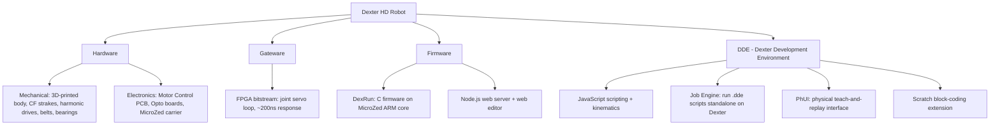

# 001 - Dexter Project Overview

## Verification status
This spec is a **compilation and reconciliation** of prior Haddington Dynamics documentation (GitHub wiki, BOM
spreadsheets, YouTube build series) and third-party build reports (Open Source Hardware Enterprise / OSHE). It has
**not** been verified end-to-end against a physical build by this fork's maintainer. Treat gaps flagged "OPEN
QUESTION" as unresolved until confirmed by an actual build.

## What Dexter is
Dexter is an open source, mostly-3D-printed robotic arm developed by Haddington Dynamics (Las Vegas). It won top
honors and $50,000 in the 2018 Hackaday Prize, after which the newest version was open-sourced. It is designed for
precision manipulation at low cost relative to industrial arms, using:
- Strain-wave ("harmonic") drives on joints 1-3 for high-ratio, backlash-free reduction.
- Custom optical encoders giving roughly one million counts per revolution at each joint.
- A Xilinx MicroZed FPGA + ARM SoC running a fast (~200ns) position-control loop directly at the joint.
- NEMA-17 stepper motors as the motive source.
- Kevlar-belt pulley reductions for joints 4 and 5 (wrist).

## Generations
There are three generations in the upstream repository. They are **not** interchangeable — parts, BOMs, and
assembly steps differ between them. This fork's specs describe **Dexter HD** unless stated otherwise, since it is
the best-documented and most recent generation with public assembly/BOM data.

| Generation | Branch / location | Body material | Assembly/BOM availability |
|---|---|---|---|
| Dexter 1 | `master` branch | PLA (FDM) | BOM exists (40-unit contest-kit spreadsheet), no structured PBS |
| Dexter HD | default branch (this repo, `Stable_2020_02_04_ConeDrive`) | Onyx / carbon-fiber via MarkForged | BOM exists as a structured Product Breakdown Structure (WIP); assembly notes exist as prose + video series |
| Dexter HDI | same repo, newer sub-variant | Onyx / carbon-fiber, PhUI-enabled | Assembly, BOM, and STL files explicitly **not yet released** upstream (per repo README) |

**OPEN QUESTION:** Confirm which generation you intend to build before ordering parts. This spec set targets
Dexter HD. If HDI-specific features (e.g. factory calibration, PhUI default firmware) are required, additional
upstream gaps apply (see [002-Bill-of-Materials.md](002-Bill-of-Materials.md) and [003-Assembly.md](003-Assembly.md)).

## System composition

## Repository map (this fork)

| Path | Origin | Purpose |
|---|---|---|
| `Hardware/` | upstream | Source documents for PCBs, opto boards, mechanical reference images |
| `Firmware/` | upstream | DexRun C firmware, boot scripts, node.js web server |
| `Gateware/` | upstream | FPGA bitstream and interconnect description (largely a compiled artifact, not editable source) |
| `DDE/` | upstream | Dexter Development Environment docs, examples, calibration instructions |
| `specs/` | this fork | Consolidated BOM and assembly specs (this document set) |

Sibling repositories (not vendored into this fork, referenced by URL):
- [cfry/dde](https://github.com/cfry/dde) — DDE application source.
- [zalo/Dexter](https://github.com/zalo/Dexter) — Unity-based visualizer/IK controller.
- [Kenny2github/scratch-dexter](https://github.com/Kenny2github/scratch-dexter) — Scratch extension.

## Training / task-programming reality check
As of this writing, there is no imitation-learning or reinforcement-learning framework in the upstream project.
Available mechanisms for getting Dexter to perform a task are:
1. **DDE scripting** — write JavaScript against the kinematics/motion API, run via the GUI or headless Job Engine.
2. **PhUI teach-and-replay** — physically move the end effector to record a single pose sequence into one of a
   small number of "slots," then replay it verbatim. Not parameterized, not generalizable across object positions.
3. **Scratch blocks** — block-based scripting for simple, fixed motions; aimed at education.

None of these constitute a system for training a policy that generalizes across many different tasks. If that is a
goal, it is new work to be designed and built on top of Dexter's raw socket protocol (documented in the wiki's
`DexRun-DDE-communications` page), not something to recover from upstream. That design is out of scope for this
spec set and is tracked separately once the physical build is underway.

## Sources consulted
- https://github.com/HaddingtonDynamics/Dexter (code, README, issues)
- https://github.com/HaddingtonDynamics/Dexter/wiki (Hardware, HD-Build-Notes, DDE, Dexter-Setup, PhysicalUserInterface, Scratch-extension pages)
- https://hackaday.io/project/158779-dexter and its Instructions page
- Dexter HD Product Breakdown Structure spreadsheet (Google Sheets, linked from the wiki Hardware page)
- Older Dexter 1 / 40-unit contest-kit BOM spreadsheet (Google Sheets, linked from the wiki Hardware page, marked "may be out of date")
