# 001 — Dexter HDI Overview

**Dexter HDI — Design Revision A.** Dexter HDI is an open, high-precision robotic arm: a five-axis
carbon-fiber-and-3D-printed manipulator with a two-axis end effector, driven by stepper motors through
strain-wave and belt reductions, and closed-loop controlled by an FPGA that reads a high-resolution
optical encoder on the output side of every joint. It is designed to deliver near-industrial positioning
precision at a fraction of the cost and mass of a comparable industrial arm.

This document introduces the robot and the structure of its specification. Detailed requirements,
kinematics, mechanics, electronics, firmware, parts, and assembly are in the numbered documents that
follow; see the [specification map](README.md#specification-map).

## 1. Purpose

Dexter HDI exists to position and orient a tool or gripper in three-dimensional space with high
repeatability, under program control or by direct physical demonstration, using an actuation and sensing
architecture that is open, reproducible, and largely fabricable with desktop 3D printing and off-the-shelf
components. Its distinguishing design goal is **precision through output-side sensing and fast local
control** rather than through expensive, stiff, zero-backlash mechanics: every joint tolerates compliance
in its drivetrain because the encoder measures the joint's true position after the gearing, and the FPGA
corrects to the commanded position in real time.

## 2. Defining characteristics

| Characteristic | Design |
|---|---|
| Degrees of freedom | 5 arm joints (J1–J5) plus a 2-axis tool interface (roll, grip) = **5 + 2** |
| Base joints (J1–J3) | Strain-wave ("harmonic") reduction, **52:1**, driven by 0.9°/step NEMA-17 steppers at 16× microstepping |
| Wrist joints (J4–J5) | Differential pair driven through **belt/pulley reduction** (the HDI change from HD's microstep-oscillation scheme) |
| Position sensing | Custom **optical encoder on the output side of each joint** (~10⁶ counts/revolution), measuring true joint angle after the drivetrain |
| Control | **FPGA joint-servo loop** with encoder-to-motor response on the order of **200 ns**, running locally on each joint |
| Structure | 3D-printed body (Onyx / carbon-fiber-reinforced) stiffened by bonded pultruded carbon-fiber strakes and tubes |
| Mounting | **Bolted base** (rigid mount to a work surface), with a doubled base clamp at the base-to-pivot joint |
| Tool interface | Cross-generation-compatible 2-axis interface (roll + grip) using Dynamixel smart servos |
| Programming | Scripting (DDE / JavaScript kinematics API), physical teach-and-replay (PhUI), and block coding (Scratch) |

These characteristics are specified in detail in [002-Requirements.md](002-Requirements.md),
[003-Kinematics.md](003-Kinematics.md), [004-Mechanical-Architecture.md](004-Mechanical-Architecture.md),
and [005-Electronics-and-Control.md](005-Electronics-and-Control.md).

## 3. System decomposition

Dexter HDI is one physical machine realized by five cooperating subsystems.

```mermaid
graph TD
    Dexter[Dexter HDI]
    Dexter --> Mech[Mechanical structure & drivetrains]
    Dexter --> Elec[Electronics & sensing]
    Dexter --> Gate[Gateware - FPGA]
    Dexter --> Firm[Firmware - DexRun]
    Dexter --> Ctrl[Control software & interfaces]

    Mech --> M1[3D-printed body + bonded CF strakes/tubes]
    Mech --> M2[Strain-wave drives J1-J3, 52:1]
    Mech --> M3[Belt-reduced differential wrist J4-J5]
    Mech --> M4[Bolted base]
    Mech --> M5[2-axis tool interface / gripper]

    Elec --> E1[Optical encoders, output-side, per joint]
    Elec --> E2[Motor Control PCB + stepper drivers]
    Elec --> E3[MicroZed FPGA/SoC carrier]
    Elec --> E4[Power distribution]

    Gate --> G1[Per-joint servo loop, ~200ns]
    Firm --> F1[DexRun position/motion firmware on ARM core]
    Firm --> F2[Onboard kinematics + Job Engine + web server]

    Ctrl --> C1[DDE scripting + JavaScript kinematics API]
    Ctrl --> C2[PhUI physical teach-and-replay]
    Ctrl --> C3[Socket/oplet command protocol]
    Ctrl --> C4[Scratch block coding]
```

- **Mechanical structure & drivetrains** — the physical arm: joints, reductions, links, base, and tool
  interface. Specified in [004-Mechanical-Architecture.md](004-Mechanical-Architecture.md); realized by
  [007-Bill-of-Materials.md](007-Bill-of-Materials.md) and built per [008-Assembly.md](008-Assembly.md).
- **Electronics & sensing** — the optical encoders, the Motor Control PCB and stepper drivers, the
  MicroZed FPGA/SoC carrier, and power. Specified in
  [005-Electronics-and-Control.md](005-Electronics-and-Control.md).
- **Gateware (FPGA)** — the fast, local joint-servo loop that closes the position loop from each output
  encoder to its motor. Specified in [005-Electronics-and-Control.md](005-Electronics-and-Control.md#control-architecture).
- **Firmware (DexRun)** — the C program on the ARM core that interprets motion commands, runs onboard
  kinematics, applies calibration, and hosts the Job Engine and web server. Configuration and calibration
  are specified in [006-Firmware-and-Calibration.md](006-Firmware-and-Calibration.md).
- **Control software & interfaces** — how a user or program commands the robot: the DDE environment and
  its kinematics API, the PhUI physical teach-and-replay interface, the raw socket/oplet protocol, and the
  Scratch extension. Specified in [005-Electronics-and-Control.md](005-Electronics-and-Control.md#command-interface)
  and [003-Kinematics.md](003-Kinematics.md#motion-commands).

## 4. Conventions

Dexter HDI uses a right-handed world frame with **Z up, X to the operator's right, Y pointing out from the
base**. The five arm joints are numbered J1 (base rotation) through J5 (wrist yaw); the tool interface adds
a roll axis and a grip axis. Positive joint directions, link-length definitions, joint travel limits, and
the full Denavit–Hartenberg model are specified in [003-Kinematics.md](003-Kinematics.md).

## 5. Design lineage

Dexter HDI is the third generation in the Dexter line and the subject of this specification. Its design
inherits directly from Dexter HD and shares HD's core architecture (52:1 strain-wave base joints, output-side
optical encoders, FPGA joint servo, Onyx/CF body, cross-generation tool interface). HDI's deliberate
departures from HD are load-bearing enough to affect the whole machine and are specified as HDI's design,
not as annotations on HD's:

- **Belt-reduced wrist (J4/J5).** HDI resolves the wrist through a physical pulley reduction; HD obtained
  extra wrist resolution by oscillating the motor across microsteps in firmware. This changes the firmware
  drive constants and the wrist drivetrain (see
  [005-Electronics-and-Control.md](005-Electronics-and-Control.md) and
  [006-Firmware-and-Calibration.md](006-Firmware-and-Calibration.md)).
- **Bolted base and doubled base clamp.** HDI mounts to a rigid surface via a bolted base rather than
  free-standing legs, and doubles the base clamp at the base-to-pivot joint (see
  [004-Mechanical-Architecture.md](004-Mechanical-Architecture.md#base-j1)).
- **Factory-recorded calibration.** HDI's optical-encoder centers and index mapping are calibrated once and
  recorded onto the specific robot; a fielded HDI is not recalibrated (see
  [006-Firmware-and-Calibration.md](006-Firmware-and-Calibration.md#calibration-model)).
- **Revised link geometry.** HDI's link lengths differ measurably from HD's, changing several structural
  member lengths (see [003-Kinematics.md](003-Kinematics.md#link-lengths)).

The full generation lineage and the model for deriving future revisions from Revision A are in
[010-Versioning-and-Roadmap.md](010-Versioning-and-Roadmap.md).

## 6. Design maturity of Revision A

Revision A is a **buildable specification with a bounded set of open decisions**. The mechanical
architecture, kinematics, electronics, control model, firmware configuration, and calibration procedure are
specified and, in most areas, traceable to a physical HDI unit, released firmware, factory calibration
documentation, or CAD. A small number of decisions remain open (`[TBD]`) and must be closed before a
from-scratch unit is fully buildable — most importantly the strain-wave component set, the wrist reduction
ratio, the differential detail design, and the bolted-base plate. These are collected, each with the
requirement it must satisfy, in [009-Design-Completion.md](009-Design-Completion.md). No `[TBD]` item is a
gap in what is known about the robot; each is a design task owned by this project to complete Revision A.

## 7. Task programming

Dexter HDI is commanded three ways, specified in [005](005-Electronics-and-Control.md#command-interface) and
[003](003-Kinematics.md#motion-commands): **scripting** (DDE / JavaScript against the kinematics and motion
API, run interactively or headless via the onboard Job Engine), **physical teach-and-replay** (PhUI —
the operator moves the tool by hand to record and replay a pose sequence; on HDI, PhUI is the default
startup behavior), and **Scratch** block coding for simple fixed motions. Generalized task learning (a
policy that adapts across object positions and tasks) is **not** part of Revision A; if required, it is new
work layered on the socket/oplet protocol and is tracked in
[010-Versioning-and-Roadmap.md](010-Versioning-and-Roadmap.md#roadmap), not recovered from the base design.
