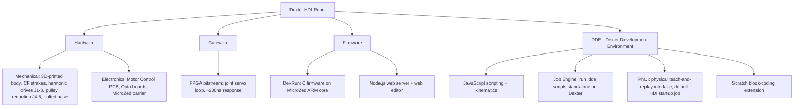

# 001 - Dexter Project Overview

## Verification status
This spec is a **compilation and reconciliation** of prior Haddington Dynamics documentation (GitHub wiki, BOM
spreadsheets, YouTube build series, upstream `Stable_Conedrive` "Dexter HDI" development branch, factory HDI
calibration PDFs shipped in this repo, and the `cfry/dde` sibling repo's kinematic/simulator source) and
third-party build reports (Open Source Hardware Enterprise / OSHE). It has **not** been verified end-to-end
against a physical build by this fork's maintainer. Content is marked one of:
- **VERIFIED** — directly quoted or read from a named upstream source.
- **FORK PROPOSAL** — this fork's own design or procedure, written to close a gap upstream never published.
  Not verified against a physical build. Treat with the same caution as any first-draft engineering design.
- **OPEN QUESTION** — a gap this fork could not responsibly close (specs/README.md documents when each pattern
  applies).

## Generation decision: this spec set targets Dexter HDI
Earlier drafts of this spec set defaulted to Dexter HD, on the reasoning that HDI was "not yet released." Closer
investigation across the upstream repo's branches, the wiki, and the `cfry/dde` sibling repo showed that
reasoning was incomplete — see [Generations](#generations) below. **This spec set now targets Dexter HDI.** Where
HDI-specific data does not exist upstream, this fork proposes a design (flagged FORK PROPOSAL) rather than
defaulting silently back to HD.

## What Dexter is
Dexter is an open source, mostly-3D-printed robotic arm developed by Haddington Dynamics (Las Vegas). It won top
honors and $50,000 in the 2018 Hackaday Prize, after which the newest version was open-sourced. It is designed for
precision manipulation at low cost relative to industrial arms, using:
- Strain-wave ("harmonic") drives on joints 1-3 for high-ratio, backlash-free reduction.
- Custom optical encoders giving roughly one million counts per revolution at each joint.
- A Xilinx MicroZed FPGA + ARM SoC running a fast (~200ns) position-control loop directly at the joint.
- NEMA-17 stepper motors as the motive source.
- Kevlar-belt pulley reductions for joints 4 and 5 (wrist).

## Generations
There are three generations in the upstream repository, and they are **not** interchangeable — parts, BOMs, and
assembly steps differ between them.

| Generation | Branch / location | Body material | Assembly/BOM availability |
|---|---|---|---|
| Dexter 1 | `master` branch | PLA (FDM) | BOM exists (40-unit contest-kit spreadsheet), no structured PBS |
| Dexter HD | default branch (`Stable_2020_02_04_ConeDrive`) | Onyx / carbon-fiber via MarkForged | BOM exists as a structured Product Breakdown Structure (WIP); assembly notes exist as prose + video series |
| **Dexter HDI** | same repo, default branch shares HDI's firmware defaults; dedicated dev branch `Stable_Conedrive` (VERIFIED: `README.md` on that branch reads `# Dexter HDI`) | Onyx / carbon-fiber, PhUI-enabled, factory-calibrated | No structured PBS/BOM and no assembly-video series exist upstream; a real, published-but-scattered set of firmware, calibration, kinematic, and wiring deltas from HD exists (see below). This spec set fills the assembly/BOM gap with FORK PROPOSAL content. |

### Why "not yet released" undersold what actually exists for HDI
The upstream `official/README.md` (VERIFIED, current default branch) says under "Dexter HDI": *"Assembly, BOM,
STL files not yet released."* That line is accurate as far as it goes — there is genuinely no HDI-equivalent of
the HD Product Breakdown Structure spreadsheet or the 11-part HD assembly video series anywhere in the four repos
consulted for this spec set (`official/`, `official-wiki/`, `dde/`, `zalo-gui/`). But it is not the whole picture:

- **This fork's own default branch already ships HDI firmware defaults.** `Firmware/Defaults.make_ins` (VERIFIED,
  read directly) has its `AxisCal` and `Interpolation` lines set to the HDI values, with the HD values present
  but commented out:
  ```
  ;S, AxisCal, -332800, -332800, -332800, -36000, -36000 ;Defaults for Dexter HD
  S, AxisCal, -332800, -332800, -332800, -86400, -86400 ;Defaults for Dexter HDI

  ;S, Interpolation, 1, 1, 1, 16, 16 ;Default for Dexter HD
  S, Interpolation, 1, 1, 1, 1, 1 ;Default for Dexter HDI
  ```
  See [004-Firmware-and-Calibration.md](004-Firmware-and-Calibration.md) for the full file and what each value
  means.
- **A dedicated upstream HDI development branch exists**: `Stable_Conedrive` (and near-identical siblings
  `Stable_Conedrive_Move_To_Straight`, `XL-430-Support`), each self-titled `# Dexter HDI` in their READMEs
  (VERIFIED, `git show remotes/upstream/Stable_Conedrive:README.md`). Its own text: *"This is a development / beta
  branch... many files are not yet released for the Dexter HDI robot and if you have purchased the robot, you
  should use the private documents we've sent you rather than these GitHub repos."* This confirms Haddington
  Dynamics held HDI-specific documentation privately, outside any of the repos available to this fork.
- **Factory HDI calibration instructions ship inside this repo's tree**, undocumented in any README:
  `DDE/InitialCalibration/HDI CAL INSTRUCTIONS- STEP {1,2,3}.pdf` (VERIFIED, present in the working tree checked
  out for this fork). These are the actual factory procedure — deploying calibration files via WinSCP, running
  DDE's eye-calibration dialog, verifying index-pulse scans, and enabling the `PHUI2RCP.js` startup job — used to
  bring up a new HDI unit. See [004-Firmware-and-Calibration.md](004-Firmware-and-Calibration.md) for the full
  transcription. Their existence also confirms Cone Drive harmonic drives are used on HDI, not just HD: Step
  Three's maintenance note reads *"Cone drive lubricant needs to be replaced after 100 hours and again at 2000
  hours."*
- **The wiki documents substantial HD-vs-HDI deltas** across at least nine pages — calibration policy, PhUI
  startup behavior, link lengths, wiring, base construction, and motion envelope — none of which required treating
  HDI as unreleased to write. Each is cited in [002-Bill-of-Materials.md](002-Bill-of-Materials.md) and
  [003-Assembly.md](003-Assembly.md) at the section it affects.
- **The `cfry/dde` sibling repo (not vendored into this fork) has real, serialized-robot HDI data**: a full HDI
  3D model (`HDIMeterModel.gltf`), simulator code referencing named HDI CAD assemblies (e.g.
  `DexterHDI_Link1_KinematicAssembly_v1`, `HDI-210-001_MainPivot_v461`), and Denavit-Hartenberg kinematic
  parameters explicitly labeled `//DH params from Dexter HDI-007010` — a specific serial-numbered unit. The most
  recent HDI-relevant commit in that repo is dated 2024-04-05, two years after the last commit anywhere in
  `official/`'s branch history (2022-06-08). This confirms `cfry/dde` (the actively-maintained DDE application,
  already listed below as a sibling repo) is the best-maintained source of ongoing HDI reality, even though it is
  not vendored into this fork.

What is genuinely, confirmedly missing upstream — not inferred, not "maybe somewhere" — is narrower than the old
"not yet released" framing suggested: a **structured HDI BOM/PBS**, **HDI-specific Motor Control PCB gerbers**
(the `Stable_Conedrive` branch's `Hardware/` tree is missing the entire `Motor PCB/` folder that exists on the HD
branch), and a **published HDI differential redesign** (the wiki says one exists and is "a significant
improvement," but gives no dimensions, STLs, or part list). This spec set closes the first and last of those with
FORK PROPOSAL content built from the HD baseline plus the real deltas above; the PCB gap is addressed by an
explicit proposal to reuse HD's board (see [002.10](002-Bill-of-Materials.md#00210-wire-harness)) with a flagged,
untested risk.

## System composition



Two mechanical differences from HD are load-bearing enough to affect every downstream spec (VERIFIED, wiki
`Dynamics.md`): HDI has a **bolted base instead of the HD 6-legged aluminum-strake base**, and a **double base
clamp** (versus HD's single clamp). Both are addressed in
[002.2 Base](002-Bill-of-Materials.md#0022-base) and [003.2 Base](003-Assembly.md#0032-base).

## Repository map (this fork)

| Path | Origin | Purpose |
|---|---|---|
| `Hardware/` | upstream | Source documents for PCBs, opto boards, mechanical reference images |
| `Firmware/` | upstream | DexRun C firmware, boot scripts, node.js web server |
| `Gateware/` | upstream | FPGA bitstream and interconnect description (largely a compiled artifact, not editable source) |
| `DDE/` | upstream | Dexter Development Environment docs, examples, calibration instructions (includes the HDI factory calibration PDFs) |
| `specs/` | this fork | Consolidated BOM and assembly specs (this document set) |

Sibling repositories (not vendored into this fork, referenced by URL):
- [cfry/dde](https://github.com/cfry/dde) — DDE application source; also the best-maintained source of real HDI
  kinematic/CAD data (see above).
- [zalo/Dexter](https://github.com/zalo/Dexter) — Unity-based visualizer/IK controller. No HDI-specific content
  found there (checked).
- [Kenny2github/scratch-dexter](https://github.com/Kenny2github/scratch-dexter) — Scratch extension.

Relevant upstream branches beyond the default (all in the same `HaddingtonDynamics/Dexter` repo, referenced by
name, not checked out into this fork): `Stable_Conedrive`, `Stable_Conedrive_Move_To_Straight`, `XL-430-Support`
— all three self-titled "Dexter HDI," diverged development branches, last commits 2020-10 through 2020-12.

## Training / task-programming reality check
As of this writing, there is no imitation-learning or reinforcement-learning framework in the upstream project.
Available mechanisms for getting Dexter to perform a task are:
1. **DDE scripting** — write JavaScript against the kinematics/motion API, run via the GUI or headless Job Engine.
2. **PhUI teach-and-replay** — physically move the end effector to record a single pose sequence into one of a
   small number of "slots," then replay it verbatim. Not parameterized, not generalizable across object positions.
   On HDI, PhUI ships as the **default startup job** (VERIFIED, wiki `PhysicalUserInterface.md`) — the robot will
   not respond to DDE or other control software until PhUI is exited.
3. **Scratch blocks** — block-based scripting for simple, fixed motions; aimed at education.

None of these constitute a system for training a policy that generalizes across many different tasks. If that is a
goal, it is new work to be designed and built on top of Dexter's raw socket protocol (documented in the wiki's
`DexRun-DDE-communications` page), not something to recover from upstream. That design is out of scope for this
spec set and is tracked separately once the physical build is underway.

## Sources consulted
- https://github.com/HaddingtonDynamics/Dexter (code, README, issues, all branches — `Stable_2020_02_04_ConeDrive`,
  `Stable_Conedrive`, `Stable_Conedrive_Move_To_Straight`, `XL-430-Support`, `master`, and others)
- https://github.com/HaddingtonDynamics/Dexter/wiki — specifically `Hardware`, `HD-Build-Notes`, `Dexter-Setup`,
  `Encoder-Calibration`, `PhysicalUserInterface`, `Differential-Joint`, `Dynamics`, `End-Effectors`, `Kinematics`,
  `set-parameter-oplet`, `Motor-Control-PCB`, `DDE`, `Scratch-extension` pages
- `DDE/InitialCalibration/HDI CAL INSTRUCTIONS- STEP {1,2,3}.pdf` — factory HDI calibration procedure, shipped in
  this repo's working tree
- `Firmware/Defaults.make_ins` — this repo's live firmware defaults (HDI-configured, HD values present but
  commented out)
- https://github.com/cfry/dde — `math/DH.js`, `sim2/App.js`, `simulator/simulate.js`, `HDIMeterModel.gltf`
- https://hackaday.io/project/158779-dexter and its Instructions page
- Dexter HD Product Breakdown Structure spreadsheet (Google Sheets, linked from the wiki Hardware page) — used as
  the physical-structure baseline for HDI subassemblies not known to differ; see
  [002-Bill-of-Materials.md](002-Bill-of-Materials.md) for exactly which sections carry this caveat
- Older Dexter 1 / 40-unit contest-kit BOM spreadsheet (marked "may be out of date" upstream; not used for HDI)
