# 001 — Overview

Dexter is an open, high-precision robotic arm: a five-axis
carbon-fiber-and-3D-printed manipulator with a two-axis end effector, driven by stepper motors through
strain-wave and belt reductions, and closed-loop controlled by an FPGA that reads a high-resolution
optical encoder on the output side of every joint. It is designed to deliver near-industrial positioning
precision at a fraction of the cost and mass of a comparable industrial arm.

This document introduces the robot and the structure of its specification. Detailed requirements,
kinematics, mechanics, electronics, firmware, parts, and assembly are in the numbered documents that
follow; see the [specification map](README.md#specification-map).

## 1. Purpose

Dexter exists to position and orient a tool or gripper in three-dimensional space with high
repeatability, under program control or by direct physical demonstration, using an actuation and sensing
architecture that is open, reproducible, and largely fabricable with desktop 3D printing and off-the-shelf
components. Its distinguishing design goal is **precision through output-side sensing and fast local
control** rather than through expensive, stiff, zero-backlash mechanics: every joint tolerates compliance
in its drivetrain because the encoder measures the joint's true position after the gearing, and the FPGA
corrects to the commanded position in real time.

## 2. Defining characteristics

| Characteristic | Design |
|---|---|
| Degrees of freedom | **5 arm joints** plus a **2-axis tool interface** |
| Base joints (J1–J3) | Strain-wave ("harmonic") reduction driven by stepper motors |
| Wrist joints (J4–J5) | Differential pair driven through a belt/pulley reduction |
| Position sensing | Custom **optical encoder on the output side of each joint**, measuring true joint angle after the drivetrain |
| Control | **FPGA joint-servo loop** running locally on each joint |
| Structure | 3D-printed body stiffened by bonded pultruded carbon fiber |
| Mounting | **Bolted base** — a rigid mount to a work surface |
| Tool interface | Cross-version-compatible 2-axis interface (roll + grip) using smart servos |
| Programming | Scripting, physical teach-and-replay, and block coding |

Each characteristic is specified with its values, ratios, and part choices in the documents that follow:
[002-Requirements.md](002-Requirements.md) (targets), [003-Kinematics.md](003-Kinematics.md) (joints and
geometry), [004-Mechanical-Architecture.md](004-Mechanical-Architecture.md) (structure and drivetrains), and
[005-Electronics-and-Control.md](005-Electronics-and-Control.md) (sensing, actuation, and control).

## 3. System decomposition

Dexter is one physical machine realized by five cooperating subsystems.

```mermaid
graph TD
    Dexter[Dexter]
    Dexter --> Mech[Mechanical structure & drivetrains]
    Dexter --> Elec[Electronics & sensing]
    Dexter --> Gate[Gateware - FPGA]
    Dexter --> Firm[Firmware - DexRun]
    Dexter --> Ctrl[Control software & interfaces]

    Mech --> M1[3D-printed body + bonded CF strakes/tubes]
    Mech --> M2[Strain-wave drives J1-J3]
    Mech --> M3[Belt-reduced differential wrist J4-J5]
    Mech --> M4[Bolted base]
    Mech --> M5[2-axis tool interface / gripper]

    Elec --> E1[Optical encoders, output-side, per joint]
    Elec --> E2[Motor Control PCB + stepper drivers]
    Elec --> E3[MicroZed FPGA/SoC carrier]
    Elec --> E4[Power distribution]

    Gate --> G1[Per-joint servo loop]
    Firm --> F1[DexRun position/motion firmware on ARM core]
    Firm --> F2[Onboard kinematics + Job Engine + web server]

    Ctrl --> C1[DDE scripting + JavaScript kinematics API]
    Ctrl --> C2[PhUI physical teach-and-replay]
    Ctrl --> C3[Socket/oplet command protocol]
    Ctrl --> C4[Scratch block coding]
```

- **Mechanical structure & drivetrains** — the physical arm: joints, reductions, links, base, and tool
  interface. Specified in [004-Mechanical-Architecture.md](004-Mechanical-Architecture.md); realized by
  [007-Bill-of-Materials.md](007-Bill-of-Materials.md) and built per [008-Assembly.md](008-Assembly.md).
- **Electronics & sensing** — the optical encoders, the Motor Control PCB and stepper drivers, the
  MicroZed FPGA/SoC carrier, and power. Specified in
  [005-Electronics-and-Control.md](005-Electronics-and-Control.md).
- **Gateware (FPGA)** — the fast, local joint-servo loop that closes the position loop from each output
  encoder to its motor. Specified in [005-Electronics-and-Control.md](005-Electronics-and-Control.md#control-architecture).
- **Firmware (DexRun)** — the C program on the ARM core that interprets motion commands, runs onboard
  kinematics, applies calibration, and hosts the Job Engine and web server. Configuration and calibration
  are specified in [006-Firmware-and-Calibration.md](006-Firmware-and-Calibration.md).
- **Control software & interfaces** — how a user or program commands the robot: the DDE environment and
  its kinematics API, the PhUI physical teach-and-replay interface, the raw socket/oplet protocol, and the
  Scratch extension. Specified in [005-Electronics-and-Control.md](005-Electronics-and-Control.md#command-interface)
  and [003-Kinematics.md](003-Kinematics.md#motion-commands).

## 4. Conventions

Dexter uses a right-handed world frame anchored at the base. The five arm joints are numbered J1 through J5
from the base outward; the tool interface adds a roll axis and a grip axis. The frame definition, joint
names and positive directions, link-length definitions, joint travel limits, and the full
Denavit–Hartenberg model are specified in [003-Kinematics.md](003-Kinematics.md).

## 5. Design lineage

Dexter is a line of numbered versions, each a distinct machine rather than a variant of the last. The design
specified here develops the previous version's architecture — strain-wave base joints, output-side optical
encoders, the FPGA joint servo, the printed-and-bonded-carbon-fiber body, and the cross-version tool
interface — and departs from it in four ways load-bearing enough to affect the whole machine: the
**belt-reduced wrist**, the **bolted base and doubled base clamp**, **factory-recorded calibration**, and
**revised link geometry**. Each is specified as the design in the document that owns it, not as an
annotation on its predecessor.

The version line and the model for deriving future revisions are in
[010-Versioning.md](010-Versioning.md); the four departures are recorded, with what each replaced and why,
as the opening section of [CHANGES.md](../CHANGES.md).

## 6. Design maturity

This is a **buildable specification with a bounded set of open decisions**. The mechanical
architecture, kinematics, electronics, control model, firmware configuration, and calibration procedure are
specified and, in most areas, traceable to a physical unit, released firmware, factory calibration
documentation, or CAD. A small number of decisions remain open and must be closed before a from-scratch unit
is fully buildable. The two formerly largest — the strain-wave component set and the differential detail
design — are closed. Every open decision is collected, with the requirement it must satisfy, its
priority, its current state, and what closing it requires, in
[009-Design-Completion.md](009-Design-Completion.md). No open item is a gap in what is known about the robot;
each is a design task owned by this project to complete the current design.

## 7. Task programming

Dexter is commanded three ways, specified in [005](005-Electronics-and-Control.md#command-interface) and
[003](003-Kinematics.md#motion-commands): **scripting** against the kinematics and motion API, **physical
teach-and-replay**, and **block coding** for simple fixed motions. Generalized task learning (a policy that
adapts across object positions and tasks) is **not** part of the current design; if required, it is new
work layered on the command protocol and is tracked in [011-Roadmap.md](011-Roadmap.md), not recovered from
the base design.
