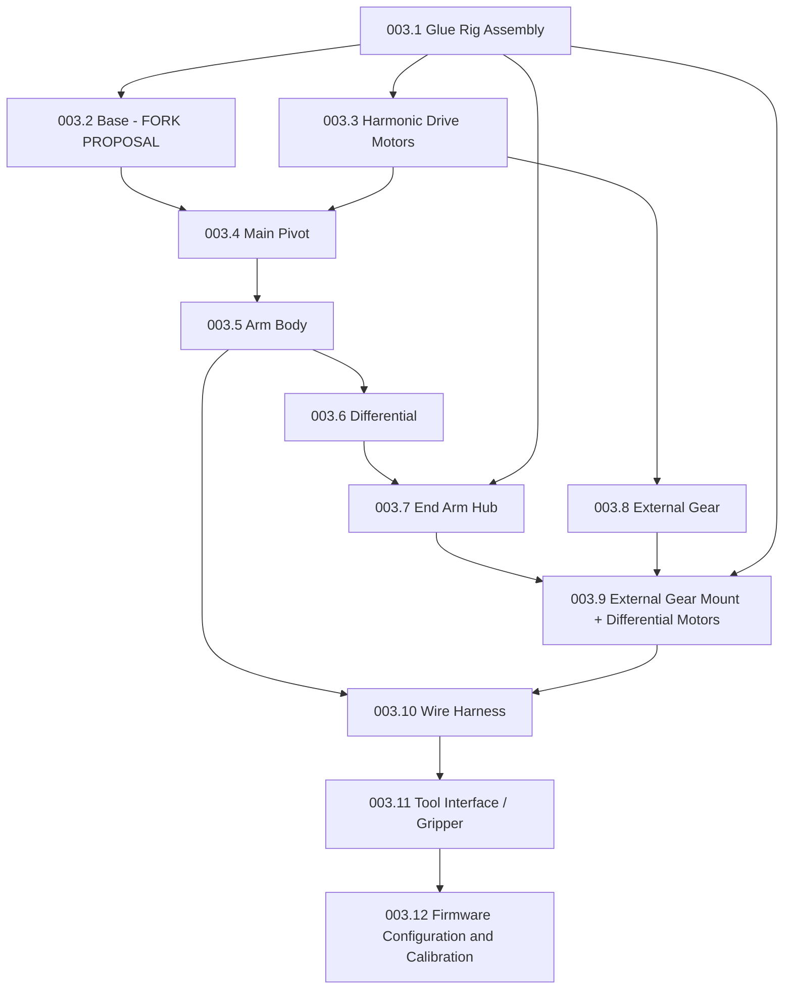

# 003 - Assembly (Dexter HDI)

## Verification status
No HDI-equivalent of the HD assembly video series (11 parts, one per subassembly) or the wiki's `HD-Build-Notes`
page exists in any source consulted for this spec set. This spec is built the same way
[002-Bill-of-Materials.md](002-Bill-of-Materials.md) was: sections with no known HDI-specific difference are
**inherited from the HD-sourced procedure** (itself a rewrite of the wiki's `HD-Build-Notes.md`, cross-referenced
against the [assembly video series](https://www.youtube.com/watch?v=AYD2PSslqfU&list=PLEJQ7hsad17fC2tqTDGNFI_LPk1kX2aE6)),
and sections with a confirmed or proposed HDI difference are marked **FORK PROPOSAL** or cite a specific wiki/PDF
source. See [001-Overview.md](001-Overview.md#verification-status) for what each marking means, and
[002-Bill-of-Materials.md](002-Bill-of-Materials.md) for the parts each section consumes.

**This has not been verified by physically building a Dexter HDI.** Steps marked **VERIFY** describe something the
HD source text left ambiguous and that could not be cross-checked against an HDI-specific source. Steps marked
**FORK PROPOSAL** are this fork's own procedure, written to cover a part ([002.2 Base](002-Bill-of-Materials.md#0022-base))
that has no HD equivalent to inherit from. If you build from this spec, please correct this file with what you
learn (see [specs/README.md](README.md) workflow) so the next builder doesn't hit the same ambiguity — this
applies with extra force to the FORK PROPOSAL sections, which are first drafts, not transcriptions.

## Assembly order

[003.12](#00312-firmware-configuration-and-calibration) is new relative to the HD-targeted draft of this spec: HDI
requires a factory-style calibration pass before first use if built from raw parts (see
[004-Firmware-and-Calibration.md](004-Firmware-and-Calibration.md)), which HD assembly did not.

## General tools and consumables (whole build)
Not itemized per-section upstream; collected here from context across all sections:
- 2-part epoxy adhesive (structural bonding of CF strakes/tubes into printed parts)
- Cyanoacrylate ("super") glue
- Hot glue gun
- Threadlocker (e.g. Loctite 243 or equivalent)
- Rubber mallet
- A short length of aluminum strake (used as a drift/punch to seat bearings without marring them)
- Bearing press or arbor press (for harmonic drive flex spline pressing, described in 003.3)
- Wave-generator depth-setting tool (**VERIFY**: upstream refers to a "Wave Gen Tool" without describing how to
  make or obtain one — likely a shop-made depth gauge; confirm via the HD video series before this step, since no
  HDI-specific source addresses it either)
- Cordless drill with a small chuck (used to ream holes and as an improvised reamer using cut-off pin stock)
- Soldering iron, solder, heat-shrink tubing, wire strippers
- Phillips head screwdriver (final base-clamp installation)
- Small flathead screwdriver or hobby knife (used in place of a wrench on M2 nuts too small for standard tools)
- **A grounded anti-static wrist strap** — the factory HDI calibration procedure ([003.12](#00312-firmware-configuration-and-calibration))
  explicitly requires this whenever handling the FPGA board; not called out in the HD-sourced build notes for
  earlier sections, but apply the same precaution throughout, since the FPGA board is present from
  [003.10](#00310-wire-harness) onward.
- WinSCP and PuTTY (or equivalent SSH/SCP clients) — required for [003.12](#00312-firmware-configuration-and-calibration)

---

## 003.1 Glue Rig Assembly
Parts: [002.1](002-Bill-of-Materials.md#0021-glue-rig-assembly). Inherited from HD (Video: Part 1 of the HD
assembly series — no HDI-specific jigging source exists).

This builds two epoxy jigs ("glue rigs") used to hold parts square while adhesive cures for later subassemblies —
it is tooling, not a robot part.

1. Assemble one "top rig" and one "bottom rig," one at a time — do not run both simultaneously.
2. Before gluing, ensure all mating surfaces are clear of the printed part's first ("zero") layer and any loose
   3D-print material.
3. Dry-fit every part on the glue rig before applying epoxy, to catch fit problems while they're still reversible.
4. Use a carbon-fiber strake to lock the Axis Intersection in place, preventing it from shifting while the
   adhesive cures.
5. Apply epoxy thoroughly to both mating surfaces of each joint.
6. Do not over-apply epoxy; wipe away excess before it cures so parts remain flush.
7. Confirm all parts sit flush and level against the glue rig; add weight on top if needed to hold position.
8. Allow the epoxy to cure per the manufacturer's recommended time before removing from the rig.

## 003.2 Base
Parts: [002.2](002-Bill-of-Materials.md#0022-base). **FORK PROPOSAL — this entire section is a new procedure, not
a transcription.** No HD video or build note applies, because the HD procedure below (epoxying feet to aluminum
strakes, then to the Base Mount Bottom) builds a structure the [002.2 Base BOM](002-Bill-of-Materials.md#0022-base)
proposes to remove entirely for HDI, in favor of a bolted baseplate and a doubled Base Clamp. Steps 1-5 below
describe that proposed procedure at the level of detail the undesigned Base Mounting Plate part allows; steps 6+
(Base Long, Base Clamp) are adapted from the HD procedure since those parts are unchanged.

1. **(FORK PROPOSAL, blocked on the Base Mounting Plate design — see [002.2](002-Bill-of-Materials.md#0022-base))**
   Bolt the Base Mounting Plate to the Base Mount Bottom in place of the HD Feet, using the fastener pattern the
   plate's final design specifies.
2. Epoxy the 133mm CF strakes into the Base Mount Bottom and Base Long, filling every other slot — these two parts
   slide together and lock in place. (Unchanged from HD — inherited procedure.)
3. When epoxying the Base Long, leave the 133mm CF strakes protruding about 1/4" (6mm) so the Base Code Disk has a
   surface to rest against once installed. (Unchanged from HD — inherited procedure.)
4. **(FORK PROPOSAL)** Bolt the assembled Base Mounting Plate to the target work surface using the bolt pattern
   and fastener size the plate's final design specifies. Unlike the HD procedure's foot-mounting options (clamp,
   screw, or hot-glue, owner's choice, described in wiki `Dexter-Setup.md`), this is not optional for HDI under
   this proposal — the plate is the sole mounting method, so confirm the target surface can take the full
   dynamic load of the arm before finishing this step.
5. **VERIFY**: this fork could not determine whether the Base Mounting Plate is intended to be removable from the
   work surface independent of the rest of the base assembly (as the HD Feet were, being separate small parts) or
   whether it is meant to stay bolted to the work surface as a permanent fixture with the rest of the base
   docking onto it. Confirm intent before finalizing the plate design in
   [002.2](002-Bill-of-Materials.md#0022-base).
6. Assemble the (now doubled) Base Clamp, per part: place an M3 washer on the hex side and thread in an M3 x 20mm
   bolt from the other side. Repeat for the second clamp. (Adapted from HD's single-clamp procedure — see step 18
   of the inherited Main Pivot mounting sequence in [003.4](#0034-main-pivot), where the clamp is actually
   installed; assembling both clamps here is a FORK PROPOSAL doubling of that single inherited step.)

## 003.3 Harmonic Drive Motors
Parts: [002.3](002-Bill-of-Materials.md#0023-harmonic-drive-motors). Inherited from HD (Video: Part 3 of the HD
assembly series) — confirmed unchanged for HDI via the identical J1-J3 `AxisCal` firmware values (see
[004-Firmware-and-Calibration.md](004-Firmware-and-Calibration.md)).
Builds 2 of the robot's 3 harmonic-drive motor assemblies (base + pivot motors); repeat for the external gear
motor in [003.8](#0038-external-gear).

1. Assemble one drive at a time.
2. Keep each Harmonic Drive's top and bottom halves paired — they are matched to each other at manufacture and
   are not interchangeable between drives.
3. Remove any first-layer print residue from the Flex Spline Attach before assembling.
4. Lubricate before pressing the Harmonic Drive's flex spline onto the Flex Spline Attach; use a press to join them.
5. After pressing, separate the flex spline from the Flex Spline Attach and inspect for any print residue that may
   have been pushed down into the attachment nubs during pressing. Remove any found before proceeding.
6. Secure the Flex Spline Attach to the motor with 4x M3 x 10mm bolts.
   **VERIFY**: the BOM does not list a distinct M3x10mm bolt row for this subassembly — confirm quantity/size
   against the HD video before ordering only what's in [002.3](002-Bill-of-Materials.md#0023-harmonic-drive-motors).
7. Tighten the M2 bolts into the Flex Spline Cap until approximately 1/4" of thread shows through the opposite side.
8. Press M3 nuts into the Wave Gen Coupler, insert M3 x 8mm hex bolts to hold them in place, then cover the nut
   heads with a small amount of epoxy to lock them in. Let cure.
9. Ream the Wave Gen Coupler and lubricate before sliding it onto the motor shaft.
10. Use the wave-generator depth-setting tool (see General Tools above) to set the Wave Gen Coupler's depth on the
    shaft.
11. Tighten the M3 x 8mm hex bolts evenly, alternating a few turns on each rather than fully tightening one at a
    time, until snug. Do not over-tighten — the mount is 3D-printed and will strip.

## 003.4 Main Pivot
Parts: [002.4](002-Bill-of-Materials.md#0024-main-pivot). Consumes 2x harmonic drive motor assemblies from
[003.3](#0033-harmonic-drive-motors) and the Base assembly from [003.2](#0032-base). Inherited from HD (Video:
Part 4), adapted only where it touches the doubled Base Clamp from [003.2](#0032-base).

1. Epoxy the 126mm CF strakes to the short end of the Main Pivot body, and the 146mm CF strakes to the long end.
   Apply epoxy to both the body's holes and the strake ends before joining.
2. Epoxy both ends (short and long) at the same time: the Main Pivot has internal weep holes connecting both ends,
   and epoxy from each side mixes inside the body. Wipe away excess as it weeps out.
3. Confirm both sets of strakes protrude from the Main Pivot by approximately the same distance once seated.
4. Press the Pivot Motor End Caps onto two 6810 bearings.
5. Slide the two-sided Pivot Code Disk onto the Main Pivot with its flat side facing away from the body.
6. Epoxy the Pivot Motor End Caps to the Main Pivot (epoxy both the body face and the cap's underside before
   joining). Orient the notch on the long-end cap toward the motor-wire hole in the long end of the Main Pivot;
   orientation does not matter for the short-end cap, since its wire hole is centered.
7. Feed the two harmonic-drive motor assemblies' wires through the Main Pivot's side holes and pull them through.
8. Epoxy the motor bottoms, the Pivot Motor End Cap faces, and the inside of the strakes / outside of the motors
   where the strakes will contact them.
9. Mount the Main Pivot assembly onto the Base:
   a. Press a 6810 bearing into the Base Long until seated about 1.5" (38mm) down. Use a rubber mallet and an
      aluminum strake as a drift if it resists.
   b. Align the Base Code Disk with the 3 protruding strakes and press down gently to snap into place.
   c. Push the Base Long (wires exiting the top) onto the Main Pivot until fully seated. If the 6810 bearing pushes
      out the opposite side, invert the assembly and tap it back into place.
   d. Remove the Flex Spline Attach's socket-head screws one at a time, adding a #6 washer under each to hold the
      bearing and lock the motor in place while adhesive cures.
10. Lubricate 4x M2 x 16mm bolts, place them in the Base Stator Holder, and screw them down.
11. Seat the Harmonic Drive top in the Base Stator Holder with the stamped "52" facing outward, aligning its two
    threaded holes with the Base Stator Holder's, then secure with 2x M3 x 12mm socket-head bolts.
12. Slide the assembled Base Stator Holder onto the Base Long's strakes, pressing down fully while occasionally
    rotating the motor shaft to ease it on.
13. Prepare 3x M3 x 105mm all-thread rods: apply threadlocker, then thread an M3 nut onto each until flush with
    the rod end.
14. Slide the assembled Base Stator Holder onto the Base Long's strakes and press down fully.
15. Slide the 3 all-thread rods (with their M3 nuts) into every other hole on the Base Stator Holder.
16. Set the Base Long onto the Base Mount and rotate until the notch in the Main Pivot lines up with the all-thread
    rods.
17. Once aligned, add a #6 washer and M3 nut onto each all-thread rod and tighten, for all 3 rods, keeping the
    notch aligned throughout.
18. **FORK PROPOSAL, adapted from HD's single-clamp step**: slide both assembled Base Clamps (see
    [003.2](#0032-base) step 6) onto the Base Mount in sequence, stacked. Remove the Base Long from the Base
    Mount, slide both Base Clamps on, then reinstall the Base Long and tighten both clamps to secure it in place.
    **VERIFY**: this fork could not determine the exact stacking order or spacing between the two clamps — the
    wiki's `Dynamics.md` note that the double clamp "affects... overall height of every z measurements" implies
    they stack rather than sit side by side, but gives no further detail.

## 003.5 Arm Body
Parts: [002.5](002-Bill-of-Materials.md#0025-arm-body). Inherited from HD (Video: Part 5).

1. Press a 6810 bearing into the Arm Body until seated about 1.5" (38mm) down.
2. Slide the Arm Body over the Pivot Motor and snap into place. If the bearing pushes back out, tap it back into
   position with a rubber mallet and an aluminum strake.
3. Remove the M3 x 12mm socket-head screws one at a time, adding a #6 washer under each, and retighten to lock the
   bearing in position.
4. Lubricate 4x M2 x 16mm bolts, place them in the Pivot Stator Holder, and screw them down.
5. Seat the Harmonic Drive top in the Pivot Stator Holder with the stamped "52" facing outward, aligning its two
   threaded holes, then secure with 2x M3 x 12mm socket-head bolts.
6. Slide the assembled Pivot Stator Holder onto the Arm Body, pressing down fully while occasionally rotating the
   motor shaft to ease it on.
7. Once seated, tap the 4 Stator Balancers into place with a rubber mallet — use light taps; the Stator Balancer is
   fragile.
8. Assemble the Belt Directors:
   a. Press the 6 MR128 bearings into the belt director bodies.
   b. Apply a drop of super glue **inside** each Belt Director (not on the Belt Director Cap — glue on the cap can
      seep in and lock up the bearing).
   c. One at a time, push the Large and Small Belt Directors through front to back, then press the Belt Director
      Caps in from the back to secure.
9. Assemble the idler: fit the MR85 bearing onto the Idler Plug's shaft, then screw in the M2 x 20mm bolt from
   back to front.
10. Hold the Belt Director Pulley between the two Belt Director halves, push the Idler Plug through from back to
    front, and press the assembly together.
11. Once seated, place the M3 washer, then the M2 washer, then the M2 nut, and tighten.

## 003.6 Differential
Parts: [002.6](002-Bill-of-Materials.md#0026-differential). Inherited from HD (Video: Part 6) as a working
substitute for the undocumented HDI differential redesign — see the gap note in
[002.6](002-Bill-of-Materials.md#0026-differential) before starting this section.

1. Insert one 6705 bearing and one 6703 bearing into Diff Body A; press until seated.
2. Insert one 6703 bearing into the End Arm Hub; press until seated.
3. Insert 2x 6703 bearings into Diff Body B, one on each side; press until seated.
4. Insert 2x MR128 bearings into the Diff Gear Shaft, one at each end; press until seated.
5. Insert one 6703 bearing and one MR128 bearing into the Split Gear Top (in their respective fitted locations);
   press until seated.
6. Insert one 6703 bearing on one side and one MR128 bearing on the other side of the Split Gear Bottom; press
   until seated.
7. Ream/drill the 4 holes visible in the sides of the Split Gear Top approximately 1/4" (6mm) deep.
8. Press the Split Gear Top into the Split Gear Bottom until seated. Rotate the Split Gear Top until its 4 holes
   are visible through the 4 windows in the side of the Split Gear Bottom.
9. Through each aligned window, insert a 1" #19 wire brad with a dab of super glue, about 1/4" (6mm) deep, for all
   4 windows. Trim the brads flush with side cutters once set.
10. Push the flat end of a small zip tie into each of the 4 windows as far as it will go, hot-glue in place, then
    trim flush with the window.
11. Epoxy the 3 25mm CF strakes into the 3 slots in the bottom of the Split Gear Bottom. Let cure.
12. Press the Diff Gear Shaft into Diff Body B until seated.
13. Press Diff Body B into Diff Body A, ensuring a tight, fully seated joint.
14. Feed all 6 End Effector wires through Diff Body B: feed the Red, White, and Blue wires through the top entrance
    around the internal opening and out the shaft on one side; feed the Black, Green, and Yellow wires through the
    bottom entrance and out the other side of the shaft (only 3 wires fit through each side channel). Confirm the
    wires can be pulled side to side and flow freely through Diff Body B before continuing.
15. Feed the wires protruding from Diff Body B's shaft through the assembled Split Gear, and slide the Split Gear
    down the shaft until it meets Diff Body B.
16. Lightly sand one end of the 96mm CF rod to improve epoxy adhesion, then epoxy the Diff End Pulley onto that end,
    6mm from the tip, with the pulley's protruding side facing the rod's long side.
17. Confirm the 6703 and MR128 bearings are fully seated in the Diff Gear Shaft so the shaft end protrudes about
    1mm past the 6703 bearing.
18. Apply a drop of super glue to the Diff Axel Keeper and snap it into place over the end of the Diff Gear Shaft,
    against the 6703 bearing.
19. Press the MR85 bearing into the back flat side of the Diff Gear Axle so it protrudes about 1mm.
20. Sand the other end of the CF rod and epoxy the Diff Gear Axle onto it.
21. Insert the CF rod through the Diff Gear Shaft until it stops.
22. Hand-turn the Split Gear to confirm everything spins freely.
23. Slide one AS Thrust Race over the End Effector wires and Diff Body B's shaft, followed by the AXK0819 bearing,
    then the second AS Thrust Race. Apply epoxy only to the chamfered edge of a Diff Keeper (use a small nail to
    apply sparingly), feed the wires through, and join it to Diff Body B.
24. Place a second Diff Keeper (or similar clamping part) on top of the epoxied one and clamp tightly until cured.

## 003.7 End Arm Hub
Parts: [002.7](002-Bill-of-Materials.md#0027-end-arm-hub). Inherited from HD (Video: Part 7).

1. Insert a 6810 bearing into each Axis Intersection half.
2. Press the New Belt Pulley into the Axis Intersection half on the Arm Body side.
3. Apply a small amount of epoxy in the holes on the Arm Body side of the Axis Intersection.
4. Epoxy the other Axis Intersection half (mirrored to match the Arm Body side) and join the two halves together,
   then epoxy the remaining holes where the 48mm CF strakes will go.
5. Slide the 48mm CF strakes into the Axis Intersection holes, wipe away excess epoxy, clamp in 2 places, and allow
   to cure per the epoxy manufacturer's specification. While curing, periodically spin the New Belt Pulley to
   confirm it turns freely and is not obstructed by seeping epoxy.
6. Epoxy the 3 81mm CF strakes into the slots in the Internal Inner Pulley, flush with the pulley face. Do not let
   epoxy seep onto the flush side — any excess will create an uneven mating surface.
7. Press 2 6703 bearings into one side of the New Belt Pulley and 1 into the other side, fully seated.
8. Align the 4 holes on the back of the End Arm Hub with the 4 nubs on the assembled Top Arm/Differential's New
   Belt Pulley, and push together.
9. Slide the Internal Outer Pulley onto the 124mm stainless steel rod, set screws facing the rod's long end, and
   lock it 3.1mm from the end. Tighten set screws incrementally and evenly (turn each partway, back off, repeat
   around the circle) until they bite into the rod and the pulley sits evenly.
10. Slide a Pulley Spacer between the Internal Inner Pulley and Internal Outer Pulley and join them into one piece.
11. Feed the assembled rod/pulley through the End Arm Hub connection as far as it goes.
12. Prepare 4x M3 x 107mm all-thread rods: thread on 2 M3 nuts and 1 washer at one end, tightened flush with the rod
    end.
13. Place the End Arm Code Disk on the outside of the Axis Intersection hub, raised side facing in.
14. Thread one all-thread rod into the End Arm Hub until it protrudes slightly through the End Arm Code Disk, then
    add an M3 washer and jam nut.
15. Add a second M3 washer and jam nut, with threadlocker on the jam-nut side, and thread it flush with the rod end.
    This step matters: the External Inner Pulley must clear all 4 jam nuts and all-thread rods to spin freely — a
    standard M3 nut is too thick and will foul the pulley.
16. Place 3 M3 nuts into the slots of the Internal Outer Pulley and cover with epoxy; place 3 M3 nuts into the
    External Outer Pulley's slots and cover with epoxy. Let both cure.
17. Thread 6 M3 x 6mm set screws into the epoxied nuts in the Internal and External Outer Pulleys, seating them
    flush with the nut ends.
18. Break the connection between the two M3 nuts at the end of each all-thread rod, add an M3 washer, and snug the
    inner nut without over-tightening.
19. Snap the End Arm Hub Cap into place.
20. Press one MR128 bearing into the end of the Internal Outer Pulley, and another into the End Arm Hub Cap.
21. Slide the External Inner Pulley onto the stainless steel rod until it stops.
22. Add the second Pulley Spacer, then the External Outer Pulley.
23. Tighten the 3 M3 set screws on the External Outer Pulley, applying pressure from both sides of the End Arm Hub
    while tightening evenly (see step 9's technique).
24. Press 2 MR128 bearings into the shaft hole of the Front Panel. **VERIFY**: source notes this hole sometimes
    needs its first print layer relieved to accept the bearings without distorting the opening or cracking it —
    inspect the fit before forcing.
25. Seat the Front Panel's bottom saddle onto the Arm Body's protrusion, sliding it over the stainless steel rod's
    shaft.
26. Apply a small amount of epoxy to the concave inner face of a Diff Keeper and join it to the Front Panel.

## 003.8 External Gear
Parts: [002.8](002-Bill-of-Materials.md#0028-external-gear). Builds the 3rd harmonic-drive motor of the robot —
follow [003.3](#0033-harmonic-drive-motors) steps 1-11 for the drive itself, then continue here. Inherited from HD
(Video: Part 8) — confirmed unchanged for HDI via the identical J1-J3 `AxisCal` firmware values.

1. Place 4 M3 nuts into the hex-shaped nut holders on the External Gear Motor End Cap.
2. Screw M3 x 10mm bolts into those nuts from the underside of the End Cap.
3. Feed the harmonic-drive motor's wires through the External Gear Motor End Cap.
4. Epoxy the bottom of the motor assembly and the top of the End Cap, then join them, aligning the End Cap's notch
   with the motor's wire exit. After joining, pull the bolts away from the End Cap so the nuts seat fully inward.
5. Press one 6810 bearing into the External Gear until seated about 1.5" (38mm) down; tap back into place with a
   rubber mallet and aluminum strake if it pushes out. Press the second 6810 bearing into the top of the External
   Gear.
6. Replace the temporary bolts one at a time with M3 x 12mm socket-head bolts and #6 washers, tightening in a
   cross/star pattern (never tighten fasteners on any Dexter assembly in a simple sequential order — always
   cross-pattern to seat parts evenly).
7. Mount the Harmonic Drive top to the External Gear Stator Holder: align the stamped "52" outward and the two
   threaded holes, lubricate the bolt shafts, and secure with 2x M3 x 12mm socket-head bolts.
8. Slide the assembled External Gear Stator Holder onto the External Gear, aligning the notches on both sides,
   pressing down fully while rotating the motor shaft until hand-tight.
9. Place M3 nuts into Nut Holder A and Nut Holder B, then slide the nut holders into the External Gear Mount,
   noting their curvature determines correct orientation. Seat them far enough in to accept the all-thread rods.
10. Feed the motor wires through the hole in the assembled External Gear Mount, slide it onto the strake holes, and
    press hand-tight.
11. Install 4x M3 x 12mm socket-head bolts to secure the External Gear in place.
12. Thread 2 M3 nuts onto one end of an M3 x 46mm all-thread rod, tightened together at the rod's end.
13. Fit the External Gear Mount Top over the External Gear, insert the M3 x 46mm all-thread rod, and tighten.
14. Install the angle and rotate motors in the External Gear Mount: feed each motor shaft from back to front through
    the mount opening, with motor wires facing the arm shaft.
15. Place M3 washers on 4x M3 x 8mm bolts, insert through the front of the External Gear Mount, and tighten in a
    cross pattern until the motor seats fully inside the mount with none of its aluminum body exposed. Do not
    over-tighten — the bolt receivers are aluminum and will strip.

## 003.9 Belts
Parts: [002.7](002-Bill-of-Materials.md#0027-end-arm-hub) and [002.8](002-Bill-of-Materials.md#0028-external-gear)
(GT2 belts and pulleys are listed against those subassemblies in the BOM; there is no separate PBS letter for
belts). Inherited from HD (Video: Part 9). See the OPEN QUESTION on J4/J5 pulley ratios in
[002.5](002-Bill-of-Materials.md#0025-arm-body) — this section builds the HD-specified pulleys as-is pending that
question being resolved.

1. Slide the 2 16T x 5mm GT2 pulleys onto the external motors.
2. Before tightening the set screws, confirm the belts will line up with the belt directors above.
3. Tighten one set screw against the flat side of each external motor shaft.

## 003.10 Wire Harness
Parts: [002.10](002-Bill-of-Materials.md#00210-wire-harness). Inherited from HD (Video: Part 10 — upstream notes
this video also covers the remaining parts list for this section), with one confirmed wiring change.

1. Snip the M2 connection on the back of the Motor Control Board to break it (side cutters or wire cutters).
2. Place the FPGA board on top of the Motor Control Board and snap into place.
3. Slide the microSD card into place on the bottom of the FPGA board until it locks; press again to unlock and
   remove if needed.
4. Align the PCB spacers with the bolt holes, then feed 4x M3 x 20mm bolts through the FPGA board, spacers, and out
   the back of the Motor Control Board.
5. Epoxy the bottom Motor Control Board PCB bracket in place, 37.5mm up from the Arm Body joint — this position
   also sets where the top PCB bracket (L2 Skin Bracket) goes when added later.
6. Hold the Motor Control Board in place with the PCB brackets on the side of the 1" CF tube opposite the epoxied
   bracket, and screw in the M3 x 20mm bolts without over-tightening (an M3 nut can back up a stripped hole if this
   happens).
7. Connect the power wires to the power connector: black to negative (-), red to positive (+).
8. **HDI wiring difference (VERIFIED, wiki `End-Effectors.md` — see full quote in
   [002.10](002-Bill-of-Materials.md#00210-wire-harness))**: when wiring the White signal wire between the Motor
   Control PCB and Tool Interface, connect it to the **2nd ground terminal** (labeled "-" on the small screw
   terminal near the top of the motor board) — **not** to a servo-power tap as on HD. Double-check this connection
   before first power-on: on an HD harness, White can carry 6-8.75V; wiring it as ground on HDI while it is still
   tapped for power elsewhere in the harness would short a power rail to ground.

## 003.11 Tool Interface / Gripper
Parts: [002.11](002-Bill-of-Materials.md#00211-tool-interface--gripper). Inherited from HD (Video: Part 11) —
confirmed cross-generation compatible (see [002.11](002-Bill-of-Materials.md#00211-tool-interface--gripper)).

1. Dry-fit the 25mm CF strake in the Span Mount's triangular top slot to confirm it will slide in once epoxy is
   applied.
2. Mix a small amount of epoxy, apply to the 25mm strake, and slide it into the Span Mount's triangular slot until
   the strake's top is flush with the notch at the top of the Span Mount and flush with the inner surface at the
   bottom.
3. Slide 3 M3 nuts into the outer slots of the Tool Interface Body, then align them by screwing M3 x 10mm bolts
   into the 3 outer holes. Once aligned, force a small amount of epoxy into the holes above the nuts to lock them
   in place.
4. Press 2 6703 bearings into each side of the Roll Body.
5. Clip the head off a 1"-#19 satin pin and chuck it in a cordless drill; use it to ream the 4 smallest holes on
   the bottom of the Roll Driver.
6. Push 4 satin pins through the reamed holes until they protrude about 1/4" (6mm) on the far side, then cut the
   heads off and secure with a drop of super glue, pushing flush with the Roll Driver. Trim the opposite side flush
   and sand both sides smooth with no sharp edges.
7. When threading in the 4 M2 x 20mm bolts on the Roll Driver, leave 2 diagonally-opposite bolts protruding about
   2mm — just enough to engage the Span Mount's holes without shifting.
8. Press the Roll Driver's flat side into the non-flat side of the Roll Body, through until flush with the 6703
   bearing on the far side; tap gently with a rubber mallet if there's resistance.
9. Identify the two servo motors, labeled 1 and 3. Move the connector from motor 1 into motor 3.
10. Press the connectors against the groove on each motor's top edge and slide each motor down into the Tool
    Interface Body until it snaps into place.
11. On the 3-pin connector, mark all 3 pins with a sharpie: blue = data (left), red = power (middle), black =
    ground (right), viewed from the front of the Tool Interface (M3 x 10mm bolt facing you); the connector on the
    opposite side of the servo is mirrored.
12. Cut the 3 wires in the middle of the right-side connector (removing the top connector portion) and feed them
    through the middle hole of the servo motor toward the top of the Tool Interface Body. Tin the stripped ends
    with solder to bind the strands.
13. Trim each wire to about 1/2" (13mm) and strip the top 1/4" (6mm).
14. Looking from the front, the topmost wire on the servo (closest to the top of the Tool Interface Body) is
    ground — solder it to the black-marked pin. The middle wire is power — solder to red. The bottom wire is data —
    solder to blue. The opposite-side connector is mirrored.
15. Add heat-shrink over each connection as you solder it, then shrink with a heat gun.
16. Feed 4x 25cm (10") lengths of 28 AWG wire (black, red, blue, green) through the center hole of the Roll Driver
    and press them into the Span Mount's groove.
17. Align the Roll Driver's bolts with the Span Mount's bolts and tighten while keeping the wires seated in the
    groove, until they protrude slightly through the Span Mount holes.
18. Thread an M2 washer and M2 nut onto each, using a small flathead screwdriver or hobby knife to spin the nut (a
    standard wrench does not fit). Wedge and hold with the screwdriver while tightening fully.
19. Remove the bolt in the motor cap without turning the motor — turning it will misalign the zero position and
    require a reset.
20. With the Roll Driver and Span Mount joined, feed the Roll Body end of the wires into the center hole of the
    motor without turning the motor. Pull the wires through until the Roll Driver nearly contacts the motor, then
    match the drive nubs as close to zero as possible — the Span Mount's nubs should sit on top at zero. The Span
    Mount Eye should read 90 degrees when the Roll Body is pushed onto the Tool Interface.
21. Gently push the Roll Driver into the motor, rocking the Span Mount slightly to confirm it has engaged.
22. Thread 2 M2 x 12mm bolts into the Roll Body's end holes and secure with M2 nuts (leave the center hole empty).
23. Thread 4 M2 x 16mm bolts through the remaining 4 holes and secure with M2 washers.
24. On the Span Motor (labeled #1), remove the center screw as with the Roll Motor, then remove its plastic driver.
25. Align the motor's driver with the hole in the Span Mount and push the motor into the 2 nubs at the Span Mount's
    base to hold it in place.
26. Fasten with 2 M2 x 12mm bolts (to the right of the Span Mount), M2 washers, and M2 nuts.
27. Connect the two motors: solder the Roll Motor's remaining connector using the same color scheme as before, then
    feed the 3 wires through the right hole of the servo toward the top of the Tool Interface Body.
28. Trim each wire to about 1/2" (13mm) and strip the top 1/4" (6mm), following the same top-to-bottom color mapping
    as step 14 (ground/power/data), except this side maps to blue/red/black directly rather than the sharpie-marked
    connector.
29. Cut 3 pieces of 1/4" heat-shrink and slip over the black, red, and blue wires exiting the Tool Interface Body.
30. Solder matching-color wires together, slide heat-shrink over each joint, and shrink with a heat gun.
31. Plug the cut-off connector end into the back of the Span Motor. Trim its wires and the remaining wires from the
    other end of the Tool Interface Body to about 1/4" (6mm), then solder together.
32. Solder the original first connector's end to the wires feeding the Span Motor before connecting to the Roll
    Motor; pull the joint taut away from the Span Motor before making the Roll Motor connection, so it isn't left
    slack against the motor.
33. Repeat the solder/heat-shrink process for the remaining wire pairs.
34. Once wiring is complete, glue down the wires exiting the base of the Tool Interface with super glue, so Span
    Mount rotation cannot snag or damage them.
35. Power the motors briefly to confirm they turn and their status LEDs light.
36. Note the notch inside the Span Driver's center bore — this must align with the corresponding driver key on the
    motor.
37. Push the Span Driver into place once aligned, and secure with an M2.6 x 10mm bolt, snug but not overtightened
    (over-tightening will strip the mount, which is designed only to hold the driver in position).
38. Clip the head off a 1"-#19 satin pin, chuck it in a cordless drill, and use it to ream the 2 small holes on top
    of the Pinion Gear.
39. Coat the satin pins in super glue and press them into the reamed holes with needle-nose pliers, as far as they
    will go. Let cure, then trim flush with the Pinion Gear and lightly sand any rough cuts.
40. Place an M3 nut in the Pinion Gear.
41. Press the remaining 2 MR128 bearings into both sides of the Parallel Static Finger.
42. Slide the Pinion Gear into the Parallel Static Finger with its horseshoe cutout facing the opening.
43. Align the Pinion Bearing EXT with the short hash mark on the Pinion Gear (these parts fit together only one
    way) and secure with an M3 x 16mm bolt, snug but loose enough that the Pinion Bearing EXT still turns freely.
44. Turn the Span Driver until its flat side faces forward, horseshoe side toward you — this is the gripper's open
    position.
45. Turn the Pinion Gear on the Parallel Static Finger until the hash mark on the Pinion Bearing EXT aligns with the
    long hash mark on the Parallel Static Finger.
46. Push the Parallel Static Finger onto the Span Mount firmly enough that the 25mm strake seats into its
    corresponding hole in the Span Mount.
47. Slide the Dynamic Finger into the Parallel Static Finger and close fully.
48. Cut two pieces of yoga mat to fit the inside faces of the Parallel Static Finger and Dynamic Finger, and
    hot-glue them in place as grip pads.

## 003.12 Firmware Configuration and Calibration
Parts/config: [004-Firmware-and-Calibration.md](004-Firmware-and-Calibration.md). **New relative to an HD build —
HDI's optical encoders and index-pulse mapping must be brought up before first use, and the procedure differs
enough from HD's that it is documented as its own spec rather than folded into this one.**

1. Set `Firmware/Defaults.make_ins` per [004.1](004-Firmware-and-Calibration.md#0041-firmware-defaults-defaultsmake_ins),
   using the HDI `AxisCal`/`Interpolation` values (already the active, uncommented defaults in this repo) and the
   correct `LinkLengths` for the physical build.
2. **If this is a from-scratch build** (new opto boards, new code disks, new harmonic drives — no factory
   calibration data exists for this specific robot): run the full factory calibration procedure in
   [004.3](004-Firmware-and-Calibration.md#0043-factory-calibration-procedure-from-scratch-builds-only) before
   proceeding. Read [004.2](004-Firmware-and-Calibration.md#0042-calibration-policy-do-not-calibrate-an-hdi-in-the-field)
   first — this is the one point in the entire build where getting a step wrong is hard to recover from.
3. **If reusing an already-calibrated HDI unit's electronics** (e.g. rebuilding a mechanical failure around
   existing opto boards/FPGA with intact `AdcCenters.txt`/`HiMem.dta`/`post_cal_info.JSON`): skip step 2 entirely.
   Recalibrating a unit that already has valid factory data is explicitly against upstream guidance (see
   [004.2](004-Firmware-and-Calibration.md#0042-calibration-policy-do-not-calibrate-an-hdi-in-the-field)) and this
   spec does not recommend it as a verification step.
4. Confirm `RunDexRun` is configured per
   [004.3 step 17](004-Firmware-and-Calibration.md#0043-factory-calibration-procedure-from-scratch-builds-only)
   so the robot finds its home position and starts PhUI on boot, per
   [004.4](004-Firmware-and-Calibration.md#0044-boot-sequence-and-phui).
5. Power-cycle and observe the boot sequence described in
   [004.4](004-Firmware-and-Calibration.md#0044-boot-sequence-and-phui): OS load, then (unlike HD/Dexter 1) a
   minute or two of home-finding, then PhUI. The robot will not respond to DDE until PhUI is exited.
