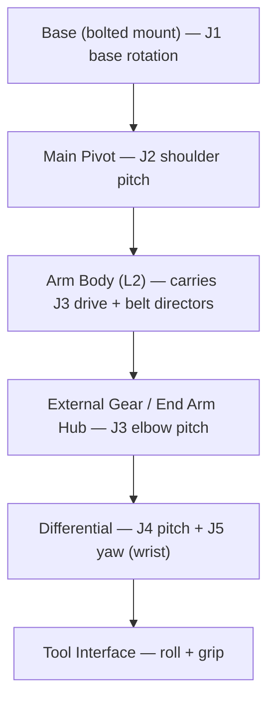

# 004 — Mechanical Architecture

This document specifies the mechanical design of Dexter: the structural philosophy, the kinematic
chain, and the joint-by-joint drivetrain and structure. It implements the structural requirements
([002](002-Requirements.md#4-structural-and-mechanical-requirements)) and the geometry
([003](003-Kinematics.md)). The parts that realize it are listed in
[007-Bill-of-Materials.md](007-Bill-of-Materials.md); the procedure that builds it is
[008-Assembly.md](008-Assembly.md).

## Structural philosophy

Dexter is built as a **3D-printed body stiffened by bonded pultruded carbon fiber**. Printed parts
(Onyx / carbon-fiber-reinforced nylon) form the complex joint housings, motor mounts, and pulleys; straight
structural spans are carbon-fiber square tubes and flat "strakes" epoxy-bonded into printed sockets. This
yields a light, stiff arm at low cost and with desktop fabrication.

The design deliberately **tolerates drivetrain compliance**. Because every arm joint is measured by an
optical encoder on its *output* (after the reduction) and corrected by a fast local servo loop
([005](005-Electronics-and-Control.md#control-architecture)), the mechanics need not be perfectly stiff or
zero-backlash: the loop closes on true joint position. This is what allows a mostly-printed arm to reach
high precision (REQ-PRE-1).

## Kinematic chain

Three strain-wave-driven joints (J1–J3) position the arm; a belt-driven differential (J4–J5) forms the
wrist; a two-axis tool interface acts at the end. Structural link spans L1–L5 are defined in
[003](003-Kinematics.md#link-lengths).

## Materials and construction methods

| Element | Design |
|---|---|
| Printed body | Onyx / CF-reinforced nylon; CF reinforcement ("CF" parts) on the highest-load housings |
| Structural spans | Pultruded carbon-fiber square tubes (1", 0.75") and flat strakes, epoxy-bonded into printed sockets |
| Reductions J1–J3 | 52:1 strain-wave (harmonic) drives |
| Reduction J4–J5 | GT2 timing belts + printed/bonded pulleys driving a differential |
| Bearings | Standard metric ball bearings (trade sizes 68xx, 67xx, MRxxx) at every rotating interface |
| Fastening | M2/M3 hardware; threadlocker on structural threads; cross-pattern tightening on all multi-bolt joints |
| Bonding | Two-part epoxy (CF-to-printed structure), cyanoacrylate and hot glue (light captures) |

**Construction conventions** (apply throughout [008](008-Assembly.md)): bond CF spans with epoxy on both
mating surfaces; never tighten a multi-bolt interface sequentially — always cross/star pattern to seat parts
evenly; printed threads and aluminum motor bodies strip easily, so torque is limited and set screws are
brought up incrementally around the circle.

## Base (J1)

The base fixes the robot to the world and provides the J1 rotation axis.

- **Mounting.** Dexter uses a **bolted base**: a rigid metal plate bolted to the Base Mount Bottom and
  through to a stable work surface, replacing the previous version's six free-standing legs (the CAD base
  part is modeled as `BaseMountBottom_Bolted` / `HDI-110-001`). The mount must react the arm's full dynamic
  load (REQ-ENV-5).
  The plate is **6061-T6 aluminium, 9.5 mm (3/8″) thick, ≈200 × 200 mm** (`[Specified]`), with the
  **robot-side bolt pattern matching the existing Base Mount Bottom holes** (transfer coordinates from CAD —
  `[Provisional]`) and **4 × M6 through-holes** for bolting to the work surface (`[Specified]`). A stability
  analysis (worst-case overturning ≈45 N·m) shows a resting plate would tip, so **the plate must be bolted
  down**; the design intent is a permanent bench fixture onto which the robot base bolts and can be removed
  as a unit. Printed Onyx is under-strength for this load-bearing plate. See
  [009-Design-Completion.md](009-Design-Completion.md#base-plate).
- **Double base clamp — `[Provisional]`.** The base-to-pivot joint uses a **doubled** (stacked) base clamp
  rather than the previous version's single clamp. This adds height at the base and is consistent with the
  +6.6 mm L1 delta ([003](003-Kinematics.md#link-lengths)); the exact stacking/spacing is to be confirmed on
  build.
- **Base rotation drive.** J1 is driven by a strain-wave base motor (see below); the base structure carries
  the Base Code Disk and stator for the J1 encoder and reduction.

*Source: wiki `Dynamics.md` (bolted base, double clamp); L1 firmware delta.*

## Base joints J1–J3: strain-wave drive

J1 (base rotation), J2 (shoulder pitch), and J3 (elbow pitch) each use a **52:1 strain-wave reduction**
driven by a **0.9°/step NEMA-17 stepper at 16× microstepping**, giving 332800 commanded steps per joint
revolution ([006](006-Firmware-and-Calibration.md#drive-constants-axiscal)). The strain-wave principle gives
a high ratio, compact, near-zero-backlash reduction — the reason these joints hold position precisely.

Each drive comprises the **strain-wave component set** — a flex spline, a wave generator, and a circular
("stator") gear — plus printed adapters (Wave Gen Coupler, Flex Spline Attach/Cap) that couple it to the
motor shaft and the printed joint output. J1 and J2 are built as the base and pivot motor assemblies; J3's
drive is the **External Gear** assembly, in which the harmonic motor turns an external gear ring at the
elbow. All three are the same reduction (identical `AxisCal`), unchanged from the previous version.

- **Strain-wave component set — `[Provisional]`.** The flex spline, wave generator, and circular gear are
  identified to a specific part — the **HanZhen "number 14" 52:1 component set** (`Hardware/README.md`;
  9–12 wk lead, contact direct) or the **Cone Drive** equivalent that the CAD model is built around (the stator
  holders are modeled as `HDI-311-006B_J2StatorHolder_ConeDrive`). Only the live procurement quote is open;
  it is the highest-risk, longest-lead item — resolve it first. See
  [009-Design-Completion.md](009-Design-Completion.md#strain-wave-component-set). Three sets are required
  (J1, J2, J3).

*Source: firmware `AxisCal`; wiki `Hardware.md`, `Joints.md`; factory maintenance note (Cone Drive).*

### Main Pivot (J2) and Arm Body (J3 support / L2)

The **Main Pivot** is the printed shoulder housing carrying the J2 encoder disk and the J2 pivot motor; its
short/long ends are stiffened with bonded CF strakes and it mounts onto the base via a pressed bearing and
all-thread tie rods. The **Arm Body** forms the L2 span (J2→J3, 339 mm) as a 1" CF square tube bonded into
a printed body, and additionally carries the **belt directors** — printed, bearing-guided pulleys that route
the J4/J5 drive belts along the arm to the differential. Because L2 is +18.4 mm versus the previous
version, the Arm Body tube is cut **282.4 mm** (264 mm + 18.41 mm — the link delta falls entirely in the
tube if the socket seat matches the previous version's) (`[Provisional]`; the printed body is renumbered,
so confirm the socket seat depth
against the CAD model before cutting — see [007](007-Bill-of-Materials.md) and
[009](009-Design-Completion.md#link-member-lengths)).

## Wrist and differential (J4–J5)

J4 (wrist pitch) and J5 (wrist yaw) are the two outputs of a **differential**: two input pulleys driven in
common produce pitch, driven in opposition produce yaw. The inputs are two plain **NEMA-17 steppers** (the
"angle" and "rotate" motors, mounted in the External Gear Mount near the elbow) driving **GT2 timing belts**
that run forward along the arm through the belt directors to the differential's input pulleys. The
end-effector wiring bundle passes through the differential's hollow bore.

- **Belt reduction, not microstep oscillation — `[Specified]` (principle + net ratio), `[Provisional]`
  (tooth split).** The wrist obtains its resolution from this **physical pulley reduction**, the defining
  change from the previous version (which oscillated the motor across microsteps in firmware instead). The
  **net wrist reduction is 13.5:1**, derivable from the J4/J5 `AxisCal` (86400 / 6400;
  [006](006-Firmware-and-Calibration.md#drive-constants-axiscal)), with `Interpolation` = 1. ⚠️ **The
  previous version's 16T→90T pulleys give only 5.625:1** — reusing them unchanged against this firmware
  causes a **2.4× wrist
  error**, so the driven side must be re-toothed (and/or the differential revised) to net 13.5:1, or
  `AxisCal` set to the as-built ratio. The exact tooth-count split is a design-completion item
  ([009](009-Design-Completion.md#wrist-reduction-ratio)); the 16T motor pulley is retained.
- **Differential detail — `[Provisional]`.** The differential is significantly revised from the previous
  version. The CAD model in `dde` (`HDIMeterModel.gltf`) is a kinematic/outer-skin model — it carries the
  differential *covers* (`HDI-940-001_DiffCover`) and Link4–7 kinematic frames but **not** the mechanism
  internals (700-series Split Gear, Diff Body, Diff Gear Shaft/Axle). This specification defines the
  differential *function* and builds the previous version's differential geometry as a working substitute,
  pending recovery of the detail design from
  the **OnShape CAD** (linked in `Hardware/README.md`) or a physical unit; an incorrect flex/pivot geometry
  risks binding a joint that also carries the tool wiring through its bore. See
  [009-Design-Completion.md](009-Design-Completion.md#differential-detail-design).

### End Arm Hub (J3–J4 region)

The **End Arm Hub** is the printed structure at the elbow/wrist transition: it houses the **axis
intersection** (where the J3 and downstream axes meet), the internal and external pulleys that transfer the
belt drives across the elbow, and the L3 span (J3→J4, 307.5 mm, a 0.75" CF tube). Because L3 is −22.7 mm
versus the previous version, this tube is cut **214.3 mm** (237 mm − 22.70 mm — the link delta falls
entirely in the tube if the socket seat matches the previous version's) (`[Provisional]`; the printed body
is renumbered, so confirm the socket seat depth against the CAD model before cutting).

## Tool interface (roll + grip)

The tool interface provides the two end-effector axes and is **cross-version compatible** — it has been
carried unchanged across every version of the robot, consistent with L5 being unchanged
([003](003-Kinematics.md#link-lengths)). It carries two
**Dynamixel smart servos** — a **roll** axis (tool rotation) and a **grip/span** axis (gripper) — commanded
over the tool interface serial bus ([005](005-Electronics-and-Control.md#actuation)). The printed body
mounts the servos, routes the 6-conductor tool cable, and carries the finger/gripper hardware (static and
dynamic fingers with replaceable grip pads). `[Specified]`.

## Design-status summary

| Subassembly | Joints | Drive | Status | Open item |
|---|---|---|---|---|
| Base | J1 support | — | `[Provisional]` | Base plate — design specified, CAD hole transfer ([009](009-Design-Completion.md#base-plate)); double clamp detail |
| Base / Pivot / External-Gear motors | J1, J2, J3 | 52:1 strain-wave | `[Specified]` ratio / `[Provisional]` component set | Strain-wave set — part identified, procurement ([009](009-Design-Completion.md#strain-wave-component-set)) |
| Main Pivot | J2 | — | `[Specified]` | — |
| Arm Body (L2) | J3 support | belt routing | `[Provisional]` cut length 282.4 mm | Confirm socket seat vs CAD ([009](009-Design-Completion.md#link-member-lengths)) |
| End Arm Hub (L3) | J3–J4 | belt transfer | `[Provisional]` cut length 214.3 mm | Confirm socket seat vs CAD |
| Differential | J4, J5 | belt → differential | `[Specified]` net 13.5:1 / `[Provisional]` detail | Tooth split + detail design ([009](009-Design-Completion.md)) |
| Tool interface | roll, grip | Dynamixel | `[Specified]` | — |
