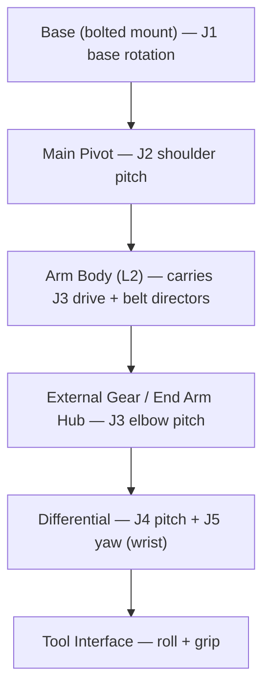

# 004 — Mechanical Architecture

This document specifies the mechanical design of Dexter: the structural philosophy, the kinematic
chain, and the joint-by-joint drivetrain and structure. It implements the structural requirements
([002](002-Requirements.md#4-structural-and-mechanical-requirements)) and the geometry
([003](003-Kinematics.md)). The parts that realize it are listed in
[007-Bill-of-Materials.md](007-Bill-of-Materials.md); the procedure that builds it is
[008-Assembly.md](008-Assembly.md).

## Structural philosophy

Dexter is built as a **3D-printed body stiffened by bonded pultruded carbon fiber**. Printed parts form the
complex joint housings, motor mounts, and pulleys; straight structural spans are carbon-fiber square tubes
and flat "strakes" epoxy-bonded into printed sockets. This yields a light, stiff arm at low cost and with
desktop fabrication. The materials themselves are specified in the table below.

The design deliberately **tolerates drivetrain compliance**: because the position loop closes on the
joint's true output angle rather than on the motor shaft, the mechanics need not be perfectly stiff or
zero-backlash. This is what allows a mostly-printed arm to reach high precision, and it is the reasoning
behind REQ-PRE-1 — stated in full in
[002](002-Requirements.md#3-precision-and-performance-requirements) and realized as described in
[005](005-Electronics-and-Control.md#control-architecture).

## Kinematic chain

Three strain-wave-driven joints (J1–J3) position the arm; a belt-driven differential (J4–J5) forms the
wrist; a two-axis tool interface acts at the end. Structural link spans L1–L5 are defined in
[003](003-Kinematics.md#link-lengths).

## Materials and construction methods

| Element | Design |
|---|---|
| Printed body | **Onyx / carbon-fiber-reinforced nylon**, printed on a desktop CF-capable printer; CF reinforcement ("CF" parts) on the highest-load housings |
| Structural spans | **Pultruded carbon fiber** — square tubes (1", 0.75") and flat strakes, epoxy-bonded into printed sockets |
| Load-bearing metal | The [base mounting plate](#base-mounting-plate) only — the one part of the robot not printed or bonded |
| Reductions J1–J3 | 52:1 strain-wave (harmonic) drives |
| Reduction J4–J5 | GT2 timing belts + printed/bonded pulleys driving a differential |
| Bearings | Standard metric ball bearings (trade sizes 68xx, 67xx, MRxxx) at every rotating interface |
| Fastening | M2/M3 hardware; threadlocker on structural threads; cross-pattern tightening on all multi-bolt joints |
| Bonding | Two-part epoxy (CF-to-printed structure), cyanoacrylate and hot glue (light captures) |

**Construction conventions** (apply throughout [008](008-Assembly.md)): bond CF spans with epoxy on both
mating surfaces; never tighten a multi-bolt interface sequentially — always cross/star pattern to seat parts
evenly; printed threads and aluminum motor bodies strip easily, so torque is limited and set screws are
brought up incrementally around the circle.

## Base (J1)

The base fixes the robot to the world and provides the J1 rotation axis.

**Mounting.** Dexter uses a **bolted base**: a rigid metal plate bolted to the Base Mount Bottom
(`BaseMountBottom_Bolted` / `HDI-110-001`) and through to a stable work surface. The mount must react the
arm's full dynamic load (REQ-ENV-5).

### Base mounting plate

| Property | Design |
|---|---|
| Material | **6061-T6 aluminium**. Steel is an acceptable alternative and adds desirable mass. Printed Onyx is **not** acceptable for a load-bearing plate |
| Thickness | **9.5 mm (3/8″)** in aluminium, ≈6 mm in steel |
| Footprint | **≈200 × 200 mm** square |
| Robot-side bolt pattern | **8 × M6 tapped through**, on the coordinates below |
| Work-surface bolt pattern | **4 × Ø6.6 mm clearance holes** at (±85.000, ±85.000) mm |

**Robot-side hole pattern.** The Base Mount Bottom presents a 150 × 150 mm flange, 10.000 mm thick, whose
eight mounting holes the plate is tapped to match. They are not on a bolt circle: they sit in pairs on the
flange's four edges, 25.000 mm apart and 62.500 mm out, so the pattern is unchanged by a 90° rotation of
the robot on its plate. Coordinates are from the J1 axis, in the plate's plane:

| | x (mm) | y (mm) |
|---|---|---|
| Pair on +y edge | ±12.500 | +62.500 |
| Pair on −y edge | ±12.500 | −62.500 |
| Pair on +x edge | +62.500 | ±12.500 |
| Pair on −x edge | −62.500 | ±12.500 |

**The bolt is M6 socket head cap, 8 off, 18 mm long.** It passes through the flange and takes 8 mm of
thread in the plate, leaving 1.5 mm of tapped depth unused so that nothing protrudes below the plate.

The flange is printed at **Ø6.000 through with a Ø10.000 × 6.0 mm counterbore** on its upper face, which
is under size for M6 on both diameters. The flange is therefore **opened on assembly to Ø6.6 through and
Ø11.0 counterbore** ([008.2](008-Assembly.md#0082-base)). The head seats on the counterbore floor and is
driven from inside the base, which is open above it.

**Stability rationale.** The worst-case static overturning moment — the arm fully extended, moving-link mass
lumped near mid-reach plus payload at full reach, with a ×2 dynamic factor — is ≈ **45 N·m**. A plate that
merely *rests* on the bench would need impractical mass to resist that: a 250 × 250 × 10 mm steel plate at
≈4.9 kg supplies only ≈6 N·m of restoring moment, so it tips. **The plate must therefore be fixed to the
work surface**, at which point the moment reacts as bolt tension of ≈300 N at the far bolt, well within an
M6's capacity. Through-bolting the four corner holes is the specified method; clamping the plate to a
T-slot table by the same corners is equivalent if each clamp is rated to that tension. **The base clamps
are not part of this load path** — they join the Base Long to the Base Mount inside the base column and
carry no plate-to-bench load.

The work-surface fastener is **M6 bolt, property class 8.8 or better, with a plain washer under the head
and under the nut, and a nut — 4 sets**. Length is **9.5 mm plate + work-surface thickness + 12 mm** for
the washers, nut and thread run-out, rounded up to a stock length. The work surface must give access to
its underside for the nuts; where it does not, use the T-slot clamp alternative above.

**Design intent: the plate is a permanent bench fixture; the robot base bolts onto it and can be removed as
a unit while the plate stays fixed.**

**Double base clamp.** The base-to-pivot joint uses a **doubled** (stacked) base clamp.

The two clamps stack face to face with no spacer. Each is **15.000 mm** tall with flat, parallel end faces,
and the Base Mount Bottom presents a seating shoulder at **97.000 mm** above its mounting face, 1.000 mm
below its top face. The pair therefore occupies **97.000 → 127.000 mm** above the mounting face. The clamp
sets the Base Long's axial position — the tube's lower end bottoms on nothing — so the second clamp raises
the Base Long, the J2 axis, and every height above it by **15.000 mm**.

Each clamp closes with one M3 × 20 mm bolt ([C-611](007.1-Parts-Catalog.md#6-fasteners)) through the
Ø3.500 mm holes in the Base Long's ±35.540 mm faces.

The height this produces does not agree with L1; the disagreement is
[DC-13](009-Design-Completion.md#base-height-and-l1).

**Base rotation drive.** J1 is driven by a strain-wave base motor (see below); the base structure carries
the Base Code Disk and stator for the J1 encoder and reduction.

*Source: wiki `Dynamics.md` (bolted base, double clamp); CAD parts `HDI-110-001_BaseMountBottom`,
`HDI-110-002_BaseClamp`, and `HDI-220-001_BaseLong`, and their placements in the base chain.*

## Base joints J1–J3: strain-wave drive

J1 (base rotation), J2 (shoulder pitch), and J3 (elbow pitch) each use a **52:1 strain-wave reduction**
driven by a microstepped stepper motor ([005](005-Electronics-and-Control.md#actuation)); the resulting
commanded step resolution is derived in
[006](006-Firmware-and-Calibration.md#drive-constants-axiscal). The strain-wave principle gives a high
ratio, compact, near-zero-backlash reduction — the reason these joints hold position precisely.

Each drive comprises the **strain-wave component set** — a flex spline, a wave generator, and a circular
("stator") gear — plus printed adapters (Wave Gen Coupler, Flex Spline Attach/Cap) that couple it to the
motor shaft and the printed joint output. J1 and J2 are built as the base and pivot motor assemblies; J3's
drive is the **External Gear** assembly, in which the harmonic motor turns an external gear ring at the
elbow. All three are the same reduction (identical `AxisCal`), unchanged from the previous version, so
**three identical component sets are required**.

The printed adapter interfaces are cut to match the commercial component set specified in
[C-201](007.1-Parts-Catalog.md#c-201--521-strain-wave-component-set), which states its identity, price,
lead time, and the mating dimensions the adapters are cut to, each cross-checked against the printed
adapter geometry. Procurement of the set is [DC-1](009-Design-Completion.md#strain-wave-component-set).

*Source: firmware `AxisCal`; wiki `Hardware.md`, `Joints.md`; factory maintenance note; HanZhen manufacturer
drawing (`Hardware/Reference/XB1-AS-C-32.pdf`).*

### Main Pivot (J2) and Arm Body (J3 support / L2)

The **Main Pivot** is the printed shoulder housing carrying the J2 encoder disk and the J2 pivot motor; its
short/long ends are stiffened with bonded CF strakes and it mounts onto the base via a pressed bearing and
all-thread tie rods. The **Arm Body** forms the L2 span (J2→J3) as a 1" CF square tube bonded into
a printed body, and additionally carries the **belt directors** — printed, bearing-guided pulleys that route
the J4/J5 drive belts along the arm to the differential. The L2 link length is specified in
[003](003-Kinematics.md#link-lengths); the tube cut length that realizes it is specified in
[C-504](007.1-Parts-Catalog.md#c-504--braided-carbon-fibre-square-tube-1) and listed in
[007.5](007-Bill-of-Materials.md#0075-arm-body). The socket carries a concentric 25.5 × 25.5 mm chamfered
mandrel inside its 29 mm pocket, so the tube is lapped on both faces of its wall rather than one.

## Wrist and differential (J4–J5)

J4 (wrist pitch) and J5 (wrist yaw) are the two outputs of a **differential**: two input pulleys driven in
common produce pitch, driven in opposition produce yaw. The inputs are two plain **NEMA-17 steppers** (the
"angle" and "rotate" motors, mounted in the External Gear Mount near the elbow) driving **GT2 timing belts**
that run forward along the arm through the belt directors to the differential's input pulleys. The
end-effector wiring bundle passes through the differential's hollow bore.

- **Belt reduction, not microstep oscillation.** The wrist obtains its resolution from a
  **physical pulley reduction** rather than from firmware microstep oscillation. The **net wrist reduction
  is 13.5:1**, fixed by the J4/J5 drive constant
  ([006](006-Firmware-and-Calibration.md#drive-constants-axiscal)), and it is realized in **two belt stages
  either side of the elbow**:

  | Stage | Driver | Driven | Ratio |
  |---|---|---|---|
  | 1 — along the arm | `#6A0-001` **16T** motor pulley | `#430-001`/`#430-002` **108T** External pulleys | 6.75:1 |
  | — | *elbow crossing: Ø8 rod (outer channel), strake tube (inner channel)* | | *1:1* |
  | 2 — along L3 | `#421-001`/`#421-002` **40T** Internal pulleys | `#720-003` and `#720-001`'s band, **80T** | 2.0:1 |
  | | | | **13.5:1** |

  Both channels are identical, so J4 and J5 see the same reduction. The differential itself is **1:1**
  (below) and contributes nothing to it, so the whole 13.5 is carried by the two belt stages. The belts
  that run them are [C-301 and C-302](007.1-Parts-Catalog.md#3-belts-and-pulleys).

  **Why this split.** Every feasible decomposition satisfies `N_ext × N_diff = 216 × N_int`, and `N_int` is
  held at its as-built **40T**: `#421-002` Internal Inner Pulley carries its tooth ring on a Ø17 6703 seat
  (Ø18 boss), because that bearing supports the strake tube inside `#410-002` New Belt Pulley, and a GT2
  ring enclosing Ø18 with any usable wall needs N_int ≥ 34 — which would force N_ext ≥ 184, a Ø117 mm
  pulley at the elbow. Shrinking the 16T motor pulley instead needs 8–12T, whose tip diameters
  (4.6–7.1 mm) are at or below the Ø5 motor shaft. The differential input pulley is therefore what grows,
  and with N_int at 40T the requirement is `N_ext × N_diff = 8640`.

  Net ratio — and therefore joint resolution, speed and stall torque — is identical for every solution.
  What moves is **where the reduction sits**: everything between the stages carries the intermediate
  torque, so a larger first stage loads the elbow crossing harder, while a larger second stage puts a
  bigger pulley at the wrist and pushes Diff Body A out against its cover.

  | | 90 / 96 | **108 / 80 — adopted** | 120 / 72 |
  |---|---|---|---|
  | Stage 1 (motor → External) | 5.625:1 | **6.75:1** | 7.5:1 |
  | Stage 2 (Internal → differential) | 2.4:1 | **2.0:1** | 1.8:1 |
  | Torque through rod + strake tube | 2.59 N·m | **3.10 N·m** | 3.45 N·m |
  | Stage-2 belt tension at stall | 203 N | **244 N** | 271 N |
  | Differential pulley tip Ø | 60.607 mm | **50.422 mm** | 45.329 mm |
  | Diff Body A width vs the cover's 73.5 mm | ≈74.6 — **over** | **≈64.4** | ≈59.2 |
  | External pulley tip Ø | 56.788 mm | **68.247 mm** | 75.886 mm |

  Torque figures are motor stall (0.46 N·m,
  [C-101](007.1-Parts-Catalog.md#c-101--nema-17-stepper-09step)) taken through the stage lossless, and the
  tension is that torque at the 40T Internal pulley's pitch radius —
  comparative figures, not ratings. The Body A widths carry that part's existing running clearance and
  wall thickness out to the new pulley radius, so they are ±2–3 mm: enough to order the options, not to
  build to. **108 / 80 is adopted** because it leaves margin on both risks rather than spending all of it
  on either. 90/96 preserves every load path at today's values but drives Body A past the
  78 × 73.5 × 50.5 mm cover envelope that the [interface below](#differential-interface) fixes; 120/72
  keeps that envelope untouched but puts 33 % more torque through a printed tube bonded to three CF
  strakes, which nothing characterizes. The adopted split widens Body A about 4 mm inside a cover with
  13.5 mm of headroom and raises the elbow torque 20 %; its stage 2 is exactly 2:1.

  ⚠️ **The HD model set still carries the previous version's counts** — 90T External against 40T at the
  differential, netting 5.625:1 — so five parts must be re-cut before printing
  ([DC-12](009-Design-Completion.md#wrist-pulley-rework)).
- **Differential detail.** The differential detail design is **authored** as parametric
  OpenSCAD source in [`Hardware/Models/700-Differential/`](../Hardware/Models/700-Differential/): one
  `.scad` per part beside its mesh, shared dimensions in `diff_params.scad`, placements in
  `diff_assembly.scad`, and a `render-all.rs` script that renders and verifies every part. Two
  parameter sets are selectable: `config="previous"` reproduces the previous version's built differential;
  `config="revised"` meets the [interface below](#differential-interface). Physical build validation
  (binding, wiring survival, code-disk reads) remains in
  [DC-9](009-Design-Completion.md#performance-characterization).

  The recreated parts are verified against their reference meshes surface by surface, with one decided
  exception on the Diff Gear Shaft's tooth form. The verification contract, the per-part measurements
  and that exception's reasoning are in [`Hardware/Models/README.md`](../Hardware/Models/README.md#verifying-a-recreated-part-against-its-reference).

  **Authored mechanism facts** (measured from the built part set, now fixed in `diff_params.scad`): all
  three bevels — Split Gear (output), Diff Gear Shaft, and Diff Gear Axle — are **20T straight bevels at
  1:1:1**, outside diameter **44.055 mm** (module ≈ 2.057 at 45° pitch cones), one shared crown definition
  carried by all three (a rebuild history recorded below). The Split Gear and the Diff Gear Axle are not
  two similar gears but **one gear placed twice**:
  sections of the Split Gear Top and the Diff Gear Axle taken
  15.4484 mm apart agree to 0.0001 mm over 4088 points, already clocked alike. The crown is therefore
  authored once, in `diff_bevel.scad`, from four measured cones — face `r = −1.14792 z`, root
  `r = −0.11121 − 0.84952 z`, heel `r = 49.82164 + 1.44761 z` and a 45° inner face, all stated about the
  gear's own apex — plus one cubic-Bézier tooth flank. **The Diff Gear Shaft's own reference carries the
  previous revision of that gear.** It is 20T and its root radius agrees at a given height, but its
  reference's top land ran `r = 1.18343 (y − 0.5068)` where this gear's face cone is `1.14792`, and its
  root cone `r = 0.84175 y` with the apex on the origin rather than `0.84952` offset 0.131 mm. The v1
  STEP identifies the form: it states one `CONICAL_SURFACE` of slope 1.1834163 and apex 0.5064895 in
  **all four** of its bevels, and the Diff Gear Shaft's mesh reproduces that to 1.4 × 10⁻⁵ in slope — so
  the revision that produced these references re-cut three gears and left this one behind, and it still
  meshed, on a form one revision old. The Diff Gear Shaft is now rebuilt to the shared crown instead
  ([CR-3A7](../CHANGES.md)), a matched set of four rather than a faithful copy of its own superseded
  reference — the **1:1:1 claim is exact for all three** positions. Both belt inputs are **40T GT2**
  pulleys as modelled (the Diff End Pulley and the shaft's integrated pulley section), re-cut to **80T**
  under [DC-12](009-Design-Completion.md#wrist-pulley-rework); the Diff Gear
  Shaft doubles as the **J4 pivot axle** (its Ø25 section rides Diff Body A's 6705, its Ø17 rear journal
  the 6703); the Split Gear is **split along a 45° cone**, `r = z − 7` in its own frame — the Top half keeps
  what lies outside that cone and the Bottom half what lies inside it, the teeth running across the joint
  uninterrupted, which is why the halves must be clocked to each other on assembly by four Ø1.5 brads
  driven radially at **z = 12.750** — an axis the two references disagreed about by 0.5 mm and which the
  revised configuration settles on the Bottom half's value, `BRAD_Z` in `diff_params.scad`
  ([`Hardware/Models/README.md`](../Hardware/Models/README.md#what-assembling-the-set-showed)). **A correction:** an earlier revision of
  this section read the differential's 40T inputs as driven straight off the 16T motor pulley, for a
  40/16 = 2.5:1 stage. They are not — the elbow train interposes, and the belt those pulleys actually run
  is driven by the 40T Internal pulleys at 1:1, which is why the model set nets the previous version's
  5.625:1 rather than 2.5:1. Counted on the models in
  [DC-12](009-Design-Completion.md#wrist-pulley-rework).

### Differential interface

This is the **interface constraint set** the authored detail design satisfies (and any future revision must
keep satisfying). Envelope and axis figures are taken from the cover bodies and kinematic frames in
`dde/HDIMeterModel.gltf`, whose mesh vertices are in metres under a ×10 node scale and a ×100 root scale, so
world units are millimetres.

| Constraint | Value | Source |
|---|---|---|
| Outer envelope | `HDI-940-001_DiffCover` measures **78.0 × 73.5 × 50.5 mm**; `HDI-940-002_DiffCoverCap` seats on its +Y face, giving **≈78 mm across × 83 mm tall** stacked | GLTF cover bodies |
| J4 axis frame | `(0, 877.79, 18.00)` mm; the cover's own origin sits at `(0, 877.79, 0.50)` mm | GLTF `DexterHDI_Link4_KinematicAssembly` |
| J5 axis frame | `(0, 917.29, −2.00)` mm — **39.50 mm** from J4 along the arm axis | GLTF `DexterHDI_Link5_KinematicAssembly` |
| Tool frame | `(54.82, 939.84, −2.00)` mm | GLTF `DexterHDI_Link6_KinematicAssembly` |
| Travel | Full J4 and J5 travel without binding; **J5's is the demanding one** for a mechanism routing wiring through its bore | [003 § Joint travel limits](003-Kinematics.md#joint-travel-limits) |
| Bevel ratio | **1:1** — the differential neither multiplies nor divides; the net 13.5:1 is realized entirely in the two belt stages | Three identical 20T crowns (above) |
| Input pulleys | **80T GT2**, tip Ø 50.422 mm, one per channel on the J4 axis. The pulley chamber in Diff Body A must clear them | Stage 2 above; the models are re-cut under [DC-12](009-Design-Completion.md#wrist-pulley-rework) |
| Encoders | Output-side optical code disks, **J4 = 115 slots, J5 = 100 slots**, read through the Angle and Rotate photointerrupter shrouds (`#824`, `#825`). J5's disk is `#710-004` (100 slots, counted on the model); **J4 has no disk — its 115 slots are cut into `#730-002` Diff Body B's mating rim** and read across the pivot from Diff Body A ([DC-11(e)](009-Design-Completion.md#the-j4-code-disk-is-missing)) | [003 § Joint definitions](003-Kinematics.md#joint-definitions), [005 § Sensing](005-Electronics-and-Control.md#sensing) |
| Through-bore | **6 conductors** pass the hollow centre and must survive J5's full travel | REQ-IF-4, [005 § Tool interface wiring](005-Electronics-and-Control.md#tool-interface-wiring) |

**The frame separation is L4.** The 39.50 mm above is the along-arm separation of the J4 and J5 stations,
which is the quantity [003 § Link lengths](003-Kinematics.md#link-lengths) specifies as L4 and states the
convention for. The 20.00 mm across-arm offset between the same two frames is real geometry that the
five-length kinematic model does not carry.

**Envelope conformance — against the gripper covers, not this one.** Diff Body A is enclosed by
`HDI-950-001`/`-002`, which reproduce its extents with 0.25 mm clearance on three faces: cover x from
−30.250 against the Ø60 top plate's 30.000 mm radius, cover z −32.250 and +28.250 against Body A's
±29.988 mm half-width about the J5 axis at z = −2.000. Its 81 mm axis therefore lies along world **x**,
inside an 85.065 mm cover, and the previous version's 80.98 mm fits. An earlier revision of this section
compared that 80.98 mm against `HDI-940-001`'s 78.0 mm instead and called it an envelope violation; the two
parts do not overlap — `HDI-940` spans z −32.5 to 18.0 and Body A does not enter it. The
`config="revised"` trim to 77.8 mm that violation produced was reverted on 2026-09-06 under
[CR-3A7](../CHANGES.md); `BODY_A_LEN` is 81.0 mm in both
configurations.

**The wrist has no axis-to-axis distance.** The J4 and J5 axes **intersect**, at the differential centre —
inherent to a bevel differential, and the reason the measured DH set carries `a ≈ 0` on both wrist rows
([003 § DH model](003-Kinematics.md#denavithartenberg-model)). What the kinematic model carries across the
wrist is the station separation above, not a distance between two separated lines.

**The bevel apex sits `C = 48.5335 mm` above Diff Body A's base plane**, derived from the Diff Gear
Shaft's own apex and fixed by three separate seats in Body A that agree exactly: the rear 6703 face on the
Ø20 waist shoulder, the Ø27 collar 4 mm above the Ø26 step, and the 40T pulley band centred on the belt
slot. Body A's remaining datums are its 20 × 20 R4 section spanning z 1–21, its 6 × 6 belt slot at z 8–14,
and a shell mirror-symmetric about z = 11.000 over z ∈ [2, 20].

**Body A's 20 × 20 R4 arm on world +x is the tool mount**, carrying REQ-IF-4's six conductors out to the
gripper through its 131.716 mm² bore ([005 § Tool interface wiring](005-Electronics-and-Control.md#tool-interface-wiring)).
No link lands on it: the L3 tube runs along world y at (x = 0, z = 36.000), perpendicular to that arm and
in the other half of the wrist ([C-505](007.1-Parts-Catalog.md#c-505--braided-carbon-fibre-square-tube-075)).

### End Arm Hub (J3–J4 region)

The **End Arm Hub** is the printed structure at the elbow/wrist transition: it houses the **axis
intersection** (where the J3 and downstream axes meet), the internal and external pulleys that transfer the
belt drives across the elbow, and the L3 span (J3→J4) as a 0.75" CF tube. As with the Arm Body, the L3 link
length is specified in [003](003-Kinematics.md#link-lengths) and its tube cut length in
[C-505](007.1-Parts-Catalog.md#c-505--braided-carbon-fibre-square-tube-075). The L3 joint is a spigot
rather than a socket: the tube slides over a printed plug on the hub.

## Tool interface (roll + grip)

The tool interface provides the two end-effector axes and is **cross-version compatible** — it has been
carried unchanged across every version of the robot, consistent with L5 being unchanged
([003](003-Kinematics.md#link-lengths)). It carries two
**Dynamixel smart servos** — a **roll** axis (tool rotation) and a **grip/span** axis (gripper) — commanded
over the tool interface serial bus ([005](005-Electronics-and-Control.md#actuation)). The printed body
mounts the servos, routes the 6-conductor tool cable, and carries the finger/gripper hardware (static and
dynamic fingers with replaceable grip pads).

## Open items by subassembly

A subassembly not listed here has nothing open.

| Subassembly | Joints | Drive | What is open |
|---|---|---|---|
| Base | J1 support | — | Base height against L1 — [DC-13](009-Design-Completion.md#base-height-and-l1) |
| Arm Body (L2) | J3 support | belt routing | — |
| End Arm Hub (L3) | J3–J4 | belt transfer | External pulleys re-cut to 108T — [DC-12](009-Design-Completion.md#wrist-pulley-rework) |
| Differential | J4, J5 | belt → differential | Input pulleys re-cut to 80T — [DC-12](009-Design-Completion.md#wrist-pulley-rework) |
