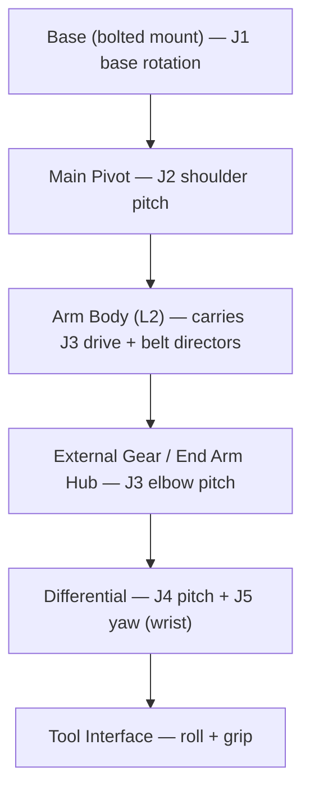

# 004 — Mechanical Architecture

This document specifies the mechanical design of Dexter: the structural philosophy, the kinematic
chain, and the joint-by-joint drivetrain and structure. It implements the structural requirements
([002](002-Requirements.md#4-structural-and-mechanical-requirements)) and the geometry
([003](003-Kinematics.md)). The parts that realize it are listed in
[007-Bill-of-Materials.md](007-Bill-of-Materials.md); the procedure that builds it is
[008-Assembly.md](008-Assembly.md).

## Structural philosophy

Dexter is built as a **3D-printed body stiffened by bonded pultruded carbon fiber**. Printed parts form the
complex joint housings, motor mounts, and pulleys; straight structural spans are carbon-fiber square tubes
and flat "strakes" epoxy-bonded into printed sockets. This yields a light, stiff arm at low cost and with
desktop fabrication. The materials themselves are specified in the table below.

The design deliberately **tolerates drivetrain compliance**: because the position loop closes on the
joint's true output angle rather than on the motor shaft, the mechanics need not be perfectly stiff or
zero-backlash. This is what allows a mostly-printed arm to reach high precision, and it is the reasoning
behind REQ-PRE-1 — stated in full in
[002](002-Requirements.md#3-precision-and-performance-requirements) and realized as described in
[005](005-Electronics-and-Control.md#control-architecture).

## Kinematic chain

Three strain-wave-driven joints (J1–J3) position the arm; a belt-driven differential (J4–J5) forms the
wrist; a two-axis tool interface acts at the end. Structural link spans L1–L5 are defined in
[003](003-Kinematics.md#link-lengths).

## Materials and construction methods

| Element | Design |
|---|---|
| Printed body | **Onyx / carbon-fiber-reinforced nylon**, printed on a desktop CF-capable printer; CF reinforcement ("CF" parts) on the highest-load housings |
| Structural spans | **Pultruded carbon fiber** — square tubes (1", 0.75") and flat strakes, epoxy-bonded into printed sockets |
| Load-bearing metal | The [base mounting plate](#base-mounting-plate) only — the one part of the robot not printed or bonded |
| Reductions J1–J3 | 52:1 strain-wave (harmonic) drives |
| Reduction J4–J5 | GT2 timing belts + printed/bonded pulleys driving a differential |
| Bearings | Standard metric ball bearings (trade sizes 68xx, 67xx, MRxxx) at every rotating interface |
| Fastening | M2/M3 hardware; threadlocker on structural threads; cross-pattern tightening on all multi-bolt joints |
| Bonding | Two-part epoxy (CF-to-printed structure), cyanoacrylate and hot glue (light captures) |

**Construction conventions** (apply throughout [008](008-Assembly.md)): bond CF spans with epoxy on both
mating surfaces; never tighten a multi-bolt interface sequentially — always cross/star pattern to seat parts
evenly; printed threads and aluminum motor bodies strip easily, so torque is limited and set screws are
brought up incrementally around the circle.

## Base (J1)

The base fixes the robot to the world and provides the J1 rotation axis.

**Mounting.** Dexter uses a **bolted base**: a rigid metal plate bolted to the Base Mount Bottom
(`BaseMountBottom_Bolted` / `HDI-110-001`) and through to a stable work surface. The mount must react the
arm's full dynamic load (REQ-ENV-5).

### Base mounting plate

| Property | Design | Status |
|---|---|---|
| Material | **6061-T6 aluminium**. Steel is an acceptable alternative and adds desirable mass. Printed Onyx is **not** acceptable for a load-bearing plate | `[Specified]` |
| Thickness | **9.5 mm (3/8″)** in aluminium — stiff against deflection under the arm's overturning moment and thick enough to tap the robot-side holes (≈6 mm if steel) | `[Specified]` |
| Footprint | **≈200 × 200 mm** — square, or the base's bolt-circle diameter plus clearance | `[Specified]` |
| Robot-side bolt pattern | Matches the existing mounting holes on `HDI-110-001_BaseMountBottom`; exact coordinates transfer from CAD | `[Provisional]` — [DC-4](009-Design-Completion.md#base-plate) |
| Work-surface bolt pattern | **4 × M6 clearance holes** near the plate corners, for through-bolting to a bench or T-slot clamping | `[Specified]` |

**Stability rationale.** The worst-case static overturning moment — the arm fully extended, moving-link mass
lumped near mid-reach plus payload at full reach, with a ×2 dynamic factor — is ≈ **45 N·m**. A plate that
merely *rests* on the bench would need impractical mass to resist that (a 250 × 250 × 10 mm steel plate at
≈4.9 kg supplies only ≈6 N·m of restoring moment, so it tips). **The plate must therefore be bolted to the
work surface**, at which point the moment reacts as trivial bolt tension (≈300 N at the far bolt, well
within an M6's capacity). **Design intent: the plate is a permanent bench fixture; the robot base bolts onto
it and can be removed as a unit while the plate stays fixed.**

**Double base clamp — `[Provisional]`.** The base-to-pivot joint uses a **doubled** (stacked) base clamp.
This adds height at the base and is consistent with the +6.6 mm L1 delta
([003](003-Kinematics.md#link-lengths)); the exact stacking and spacing is to be confirmed on build.

**Base rotation drive.** J1 is driven by a strain-wave base motor (see below); the base structure carries
the Base Code Disk and stator for the J1 encoder and reduction.

*Source: wiki `Dynamics.md` (bolted base, double clamp); L1 firmware delta; CAD part
`HDI-110-001_BaseMountBottom`.*

## Base joints J1–J3: strain-wave drive

J1 (base rotation), J2 (shoulder pitch), and J3 (elbow pitch) each use a **52:1 strain-wave reduction**
driven by a microstepped stepper motor ([005](005-Electronics-and-Control.md#actuation)); the resulting
commanded step resolution is derived in
[006](006-Firmware-and-Calibration.md#drive-constants-axiscal). The strain-wave principle gives a high
ratio, compact, near-zero-backlash reduction — the reason these joints hold position precisely.

Each drive comprises the **strain-wave component set** — a flex spline, a wave generator, and a circular
("stator") gear — plus printed adapters (Wave Gen Coupler, Flex Spline Attach/Cap) that couple it to the
motor shaft and the printed joint output. J1 and J2 are built as the base and pivot motor assemblies; J3's
drive is the **External Gear** assembly, in which the harmonic motor turns an external gear ring at the
elbow. All three are the same reduction (identical `AxisCal`), unchanged from the previous version, so
**three identical component sets are required**.

The printed adapter interfaces are cut to match the commercial component set specified in
[C-201](007.1-Parts-Catalog.md#c-201--521-strain-wave-component-set); its identity, price, and lead time are
confirmed there and dimensionally cross-checked against the printed adapter geometry in
[DC-1](009-Design-Completion.md#strain-wave-component-set). Mating dimensions: Ø50h6 housing OD into the
Stator Holder bore, Ø44 6-hole mounting circle, Ø6H7 wave-generator input bore onto the Wave Gen Coupler.
`[Specified]`.

*Source: firmware `AxisCal`; wiki `Hardware.md`, `Joints.md`; factory maintenance note; HanZhen manufacturer
drawing (`Hardware/Reference/XB1-AS-C-32.pdf`).*

### Main Pivot (J2) and Arm Body (J3 support / L2)

The **Main Pivot** is the printed shoulder housing carrying the J2 encoder disk and the J2 pivot motor; its
short/long ends are stiffened with bonded CF strakes and it mounts onto the base via a pressed bearing and
all-thread tie rods. The **Arm Body** forms the L2 span (J2→J3) as a 1" CF square tube bonded into
a printed body, and additionally carries the **belt directors** — printed, bearing-guided pulleys that route
the J4/J5 drive belts along the arm to the differential. The L2 link length is specified in
[003](003-Kinematics.md#link-lengths); the tube cut length that realizes it is derived in
[DC-5](009-Design-Completion.md#link-member-lengths) and listed in
[007.5](007-Bill-of-Materials.md#0075-arm-body). `[Provisional]`.

## Wrist and differential (J4–J5)

J4 (wrist pitch) and J5 (wrist yaw) are the two outputs of a **differential**: two input pulleys driven in
common produce pitch, driven in opposition produce yaw. The inputs are two plain **NEMA-17 steppers** (the
"angle" and "rotate" motors, mounted in the External Gear Mount near the elbow) driving **GT2 timing belts**
that run forward along the arm through the belt directors to the differential's input pulleys. The
end-effector wiring bundle passes through the differential's hollow bore.

- **Belt reduction, not microstep oscillation — `[Specified]` (principle + net ratio), `[Provisional]`
  (tooth split).** The wrist obtains its resolution from a **physical pulley reduction** rather than from
  firmware microstep oscillation. The **net wrist reduction is 13.5:1**, fixed by the J4/J5 drive constant
  ([006](006-Firmware-and-Calibration.md#drive-constants-axiscal)). The 16T motor pulley is retained; the
  **driven side must be toothed to net 13.5:1**, and the tooth-count split that realizes it — along with the
  scale error that results from getting it wrong — is [DC-3](009-Design-Completion.md#wrist-reduction-ratio).
- **Differential detail — `[Provisional]`.** The differential detail design is **authored** as parametric
  OpenSCAD source in [`Hardware/Models/700-Differential/`](../Hardware/Models/700-Differential/): one
  `.scad` per part beside its mesh, shared dimensions in `diff_params.scad`, placements in
  `diff_assembly.scad`, and a `render-all.rs` script that renders and verifies every part. Two
  parameter sets are selectable: `config="previous"` reproduces the previous version's built differential;
  `config="revised"` meets the [interface below](#differential-interface). Physical build validation
  (binding, wiring survival, code-disk reads) remains in
  [DC-9](009-Design-Completion.md#performance-characterization).

  **The recreated part geometry is not yet trustworthy.** Four of the seven recreated parts deviate from
  their reference meshes by 1.3–3.8 mm, because the original check compared diameters and face positions
  rather than surfaces and could not see shape error. The mechanism facts below were read from the
  reference meshes directly and are unaffected, but the `.scad` shapes are not — see
  [DC-2](009-Design-Completion.md#differential-detail-design) for the per-part measurements and the
  revised verification contract.

  **Authored mechanism facts** (measured from the built part set, now fixed in `diff_params.scad`): all
  three bevels — Split Gear (output), Diff Gear Shaft, and Diff Gear Axle — are **20T straight bevels at
  1:1:1**, outside diameter **44.055 mm** (module ≈ 2.057 at 45° pitch cones); both belt inputs are
  **40T GT2** pulleys (the Diff End Pulley and the shaft's integrated pulley section); the Diff Gear
  Shaft doubles as the **J4 pivot axle** (its Ø25 section rides Diff Body A's 6705, its Ø17 rear journal
  the 6703); the Split Gear is axially **split** — Top and Bottom each carry part of the tooth faces and
  clamp together, clocked through the brad windows. The as-built 40T input pulleys give a 40/16 = 2.5:1
  belt stage per input — measured data for [DC-3](009-Design-Completion.md#wrist-reduction-ratio)'s
  tooth-count split.

### Differential interface

This is the **interface constraint set** the authored detail design satisfies (and any future revision must
keep satisfying). Envelope and axis figures are taken from the cover bodies and kinematic frames in
`dde/HDIMeterModel.gltf`, whose mesh vertices are in metres under a ×10 node scale and a ×100 root scale, so
world units are millimetres.

| Constraint | Value | Source |
|---|---|---|
| Outer envelope | `HDI-940-001_DiffCover` measures **78.0 × 73.5 × 50.5 mm**; `HDI-940-002_DiffCoverCap` seats on its +Y face, giving **≈78 mm across × 83 mm tall** stacked | GLTF cover bodies |
| J4 axis frame | `(0, 877.79, 18.00)` mm; the cover's own origin sits at `(0, 877.79, 0.50)` mm | GLTF `DexterHDI_Link4_KinematicAssembly` |
| J5 axis frame | `(0, 917.29, −2.00)` mm — **39.50 mm** from J4 along the arm axis | GLTF `DexterHDI_Link5_KinematicAssembly` |
| Tool frame | `(54.82, 939.84, −2.00)` mm | GLTF `DexterHDI_Link6_KinematicAssembly` |
| Travel | Full J4 and J5 travel without binding; **J5's is the demanding one** for a mechanism routing wiring through its bore | [003 § Joint travel limits](003-Kinematics.md#joint-travel-limits) |
| Bevel ratio | **≈1:1** — the net 13.5:1 is realized in the belt stages, not inside the differential | [DC-3](009-Design-Completion.md#wrist-reduction-ratio) |
| Encoders | Output-side optical code disks, **J4 = 115 slots, J5 = 100 slots**, read through the Angle and Rotate photointerrupter shrouds (`#824`, `#825`). J5's disk is `#710-004` (100 slots, counted on the model); **J4's disk exists as no part** — [DC-11(e)](009-Design-Completion.md#the-j4-code-disk-is-missing) | [003 § Joint definitions](003-Kinematics.md#joint-definitions), [005 § Sensing](005-Electronics-and-Control.md#sensing) |
| Through-bore | **6 conductors** pass the hollow centre and must survive J5's full travel | REQ-IF-4, [005 § Tool interface wiring](005-Electronics-and-Control.md#tool-interface-wiring) |

**The frame separation agrees with the measured unit.** The 39.50 mm above lands within 0.2 mm of the J4
`d` term in the HDI-007010 DH set (39.3 mm, [003](003-Kinematics.md#denavithartenberg-model)), so the
envelope model and the measured kinematics corroborate each other. It does *not* agree with either L4
candidate in [DC-6](009-Design-Completion.md#link-length-discrepancy-l4) — a kinematic-assembly node origin
need not sit exactly on the joint axis, so treat it as corroboration of the envelope, not as an L4 value.

**Envelope conformance.** The previous version's Diff Body A is 80.98 mm across — wider than the cover's
78.0 mm — so `config="previous"` builds must omit the `HDI-940` covers or re-cut them. The authored
`config="revised"` trims Diff Body A to 77.8 mm (`BODY_A_LEN` in `diff_params.scad`); `render-all.rs`
asserts the revised body against the cover envelope.

**L4 realization.** The J4 and J5 axes **intersect**, at the differential centre — inherent to a bevel
differential, and the reason the measured DH set carries `a ≈ 0` on both wrist rows and puts the wrist
geometry in the `d` offsets instead ([003 § DH model](003-Kinematics.md#denavithartenberg-model)). The
firmware link length L4 = 59.50 mm ([DC-6](009-Design-Completion.md#link-length-discrepancy-l4)) is
therefore an offset **along the J4 axis**, and it composes as:

| Contribution | Value | Set by |
|---|---|---|
| Differential — Diff Body A's End Arm Hub mating face up to the differential centre | **31.0 mm** | `diff_assembly.scad` (identical in both configs) |
| End Arm Hub — standoff on its side of that face | **28.5 mm** | End Arm Hub design (`#500-001`) |
| **L4 total** | **59.50 mm** | `Firmware/Defaults.make_ins` |

`diff_assembly.scad` computes the differential's contribution from the built stack, echoes the hub inset
the End Arm Hub must provide, and asserts both the split and the axis intersection. **The 28.5 mm inset is
a requirement this design places on the End Arm Hub**; confirm it by caliper on the first build together
with the rest of [DC-6](009-Design-Completion.md#link-length-discrepancy-l4).

### End Arm Hub (J3–J4 region)

The **End Arm Hub** is the printed structure at the elbow/wrist transition: it houses the **axis
intersection** (where the J3 and downstream axes meet), the internal and external pulleys that transfer the
belt drives across the elbow, and the L3 span (J3→J4) as a 0.75" CF tube. As with the Arm Body, the L3 link
length is specified in [003](003-Kinematics.md#link-lengths) and its tube cut length is derived in
[DC-5](009-Design-Completion.md#link-member-lengths). `[Provisional]`.

## Tool interface (roll + grip)

The tool interface provides the two end-effector axes and is **cross-version compatible** — it has been
carried unchanged across every version of the robot, consistent with L5 being unchanged
([003](003-Kinematics.md#link-lengths)). It carries two
**Dynamixel smart servos** — a **roll** axis (tool rotation) and a **grip/span** axis (gripper) — commanded
over the tool interface serial bus ([005](005-Electronics-and-Control.md#actuation)). The printed body
mounts the servos, routes the 6-conductor tool cable, and carries the finger/gripper hardware (static and
dynamic fingers with replaceable grip pads). `[Specified]`.

## Design-status summary

Open items are summarized here by which subassembly they block; each item's state, priority, and definition
of done is in [009-Design-Completion.md](009-Design-Completion.md).

| Subassembly | Joints | Drive | Status | Open item |
|---|---|---|---|---|
| Base | J1 support | — | `[Provisional]` | [DC-4](009-Design-Completion.md#base-plate); double clamp detail |
| Base / Pivot / External-Gear motors | J1, J2, J3 | 52:1 strain-wave | `[Specified]` | — |
| Main Pivot | J2 | — | `[Specified]` | — |
| Arm Body (L2) | J3 support | belt routing | `[Provisional]` cut length | [DC-5](009-Design-Completion.md#link-member-lengths) |
| End Arm Hub (L3) | J3–J4 | belt transfer | `[Provisional]` cut length | [DC-5](009-Design-Completion.md#link-member-lengths) |
| Differential | J4, J5 | belt → differential | `[Specified]` net ratio / `[Provisional]` detail and tooth split | [DC-3](009-Design-Completion.md#wrist-reduction-ratio), [DC-2](009-Design-Completion.md#differential-detail-design) |
| Tool interface | roll, grip | smart servos | `[Specified]` | — |
