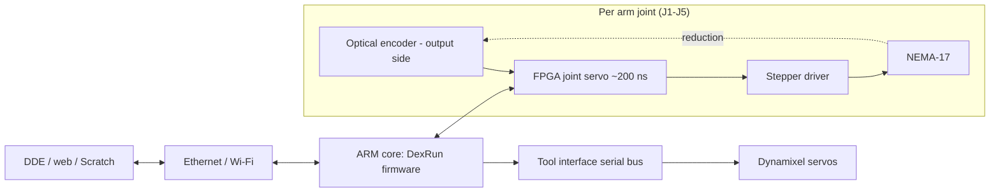

# 005 — Electronics and Control (Dexter HDI Rev A)

This document specifies how Dexter HDI senses, actuates, and is commanded: the optical encoders, the
stepper and servo actuation, the FPGA joint-servo loop, the controller boards, power, and the command
interface. It implements the electrical/control and interface requirements
([002](002-Requirements.md#5-electrical-and-control-requirements)) and drives the firmware configuration in
[006-Firmware-and-Calibration.md](006-Firmware-and-Calibration.md).

## Control architecture

The defining feature is a **fast local closed loop**: each arm joint's output-side encoder feeds the FPGA,
which adjusts the stepper to drive the *measured* joint position to the commanded position, with
encoder-to-motor response on the order of **200 ns** (REQ-CTL-1). The ARM core running **DexRun** sits above
this loop — it generates trajectories, runs onboard kinematics, applies calibration, and serves the network
interface — but does not run the tight servo loop itself. Because the loop is fast relative to the arm's
mechanical bandwidth, small sensor perturbations are filtered out mechanically (motor inertia and
inductance) rather than causing jitter.

*Source: wiki `Gateware.md`, `Joints.md`; system control diagram (`haddingtondynamics.github.io`).*

## Sensing

Each of the five arm joints carries a **custom optical encoder on the output side of the drivetrain**, so it
measures the *true joint angle* after any drivetrain compliance or backlash (REQ-PRE-1). Each encoder is a
printed **code disk** with radial slots read by LED/phototransistor **opto blocks**; interpolation between
slots yields ≈ 10⁶ counts/revolution (≈ 1.3 arcsec/count, REQ-PRE-2). Code-disk slot counts differ per joint
(J1 200, J2 180, J3 157, J4 115, J5 100 — see [003](003-Kinematics.md#joint-definitions)).

- **Index/home sensing.** Beyond incremental counts, the disks carry index features the firmware scans on
  boot to find home ("index eyes"). The mapping from raw eye readings to joint position is established by
  calibration and recorded per unit ([006](006-Firmware-and-Calibration.md#calibration-model)).
- **Eye calibration.** Each opto block has trim potentiometers set so its two phototransistor channels
  trace a centered circle as the disk turns; this centers the "eye" and is part of the factory procedure.
- The encoder→position relationship absorbs imperfect slot geometry: calibration maps commanded position to
  observed reading, so disk imperfections are effectively removed rather than becoming position error.

*Source: wiki `Encoders.md`, `Encoder-Calibration.md`, `Joints.md`.*

## Actuation

| Axis | Actuator | Drive |
|---|---|---|
| J1–J5 | **NEMA-17 stepper, 0.9°/step (400 steps/rev)**, 16× microstepping | Motor Control PCB stepper drivers, closed by the FPGA loop |
| Tool roll, grip | **Dynamixel smart servos** | Serial (Dynamixel) bus over the tool interface |

Steppers are the motive source for all five arm joints; the FPGA's output-side correction is what turns an
open-loop stepper into a precise closed-loop joint. The tool axes use Dynamixel servos with their own
internal control, commanded over the tool interface serial bus. *Source: wiki `Hardware.md`, `Joints.md`,
`End-Effector-Servos.md`.*

## Boards

| Board | Role | Status | Source of record |
|---|---|---|---|
| **Motor Control PCB** | Stepper drivers, power distribution, opto/tool connectors, FPGA carrier interface | `[Provisional]` — reuse the HD board | `Hardware/Motor PCB/` gerbers (D3/D4-corrected revision) |
| **MicroZed FPGA/SoC** | Xilinx Zynq module: FPGA fabric (joint servo, gateware) + ARM core (DexRun, Linux) | `[Specified]` | wiki `MicroZed.md` for the exact module part number |
| **Optical boards (×5)** | LED + phototransistor opto pickups, one per joint encoder | `[Specified]` | `Hardware/Opto/` gerbers/BOM |

- **Motor Control PCB — `[Provisional]`.** No HDI-specific Motor Control PCB design exists; the HDI upstream
  branch omits the board entirely. Rev A reuses the HD "green" Motor Control PCB (`09051-00135-A`, the
  revision with the D3/D4 power fix). Its gerbers/BOM (`Hardware/Motor PCB/`) show **6 × Allegro A4983
  stepper drivers** (`Z1–Z6` on `MOT1–MOT6` = 5 arm joints + 1 spare/External), `TPS54541` bucks, an
  `LTC3786` boost (the 38 V rail ceiling), the `PDS760` power Schottkys (the "D3/D4 fix"), and per-channel
  3.0 A thermal fuses. The connector set is generic, not HD-specific — `J1–J6/J24` 4-pin motor screw
  terminals, `J7–J13` 6-pin opto headers, `J14–J17` 3-pin tool headers, `J19–J21` power — which is why the
  reuse is viable and the one known HDI difference is a wiring-harness reassignment (below), not a board
  change. An HDI-native board is a roadmap item ([010](010-Versioning-and-Roadmap.md#roadmap)); the residual
  Rev A step is a physical power-on test, see [009](009-Design-Completion.md#motor-control-pcb).
- **Gateware.** The FPGA logic (the servo loop and interconnect) is authored in a graphical logic tool
  (Viva/Azido) and deployed as a bitstream; it is largely a compiled artifact rather than edited source.
  Operating "modes" (follow/helping-hand/keep-position, etc.) are FPGA configurations selected at runtime.

## Power

A single DC supply feeds the motor and logic rails through the Motor Control PCB. The supply is
**36 V DC, 4 A (≈144 W)** — a standard laptop-style DC brick. The "green" Motor Control PCB is **rated for
38 V** (the ceiling is set by the `LTC3786` boost controller); 36 V sits just under that with margin, and the
board's 50 V-rated input capacitors and PDS760 (60 V) power Schottkys support it. The motor rail feeds six
A4983 stepper drivers (≈2 A/phase, fused at 3.0 A per channel); the TPS54541 bucks derive the logic rails.

**Under-voltage is a failure mode, not just a slowdown:** a 12 V or 24 V brick causes the arm to grind/buzz,
stall mid-motion, and fail to find home. Use a 36 V / 4 A supply. `[Specified]` — *Source: wiki
`Troubleshooting.md`; Motor PCB BOM (`Hardware/Motor PCB/09011-00135-A.BOM`).* (REQ-CTL-5;
[DC-8](009-Design-Completion.md#power-supply) closed.) Servo power for the tool (6–8.75 V range referenced in
the tool wiring) is derived on the tool side.

## Command interface

Dexter HDI is commanded over the network by the **oplet protocol**: single-letter command primitives sent
over a socket to DexRun (e.g. `a` move-all, `M`/`T` Cartesian moves, `S` set-parameter, `g` get-status,
`r` read, `w` write). The motion oplets are specified in [003](003-Kinematics.md#motion-commands).

| Interface | Description | Requirement |
|---|---|---|
| **Socket / oplet protocol** | Raw TCP socket to DexRun carrying oplets; the lowest-level control interface | REQ-IF-1 |
| **DDE** | Dexter Development Environment: JavaScript kinematics/motion API, GUI + onboard Job Engine for headless runs | REQ-IF-2, REQ-PRG-1 |
| **Onboard web server** | Node.js web server / editor for browser access without installed software | REQ-IF-5 |
| **PhUI** | Physical teach-and-replay; the **default HDI startup job** — the robot does not accept DDE control until PhUI is exited ([006](006-Firmware-and-Calibration.md#boot-and-phui)) | REQ-PRG-2 |
| **Scratch** | Block-coding extension for simple fixed motions | REQ-PRG-3 |
| **SSH / USB console** | Service and calibration access | REQ-IF-3 |

*Source: wiki `DexRun-DDE-communications.md`, `Command-oplet-instruction.md`, `DDE.md`,
`nodejs-webserver.md`, `PhysicalUserInterface.md`, `Scratch-extension.md`.*

## Tool interface wiring

The tool interface connects to the Motor Control PCB through **6 conductors** (REQ-IF-4). Five assignments
are common across generations; **the White conductor differs on HDI** and this difference is
safety-relevant.

| Wire | Assignment (HDI) | Note |
|---|---|---|
| Black | Ground | |
| Red | +5 V logic | |
| Yellow | Unregulated supply power | |
| Blue | Servo data bus | |
| Green | Auxiliary / return serial data | |
| **White** | **Second ground** (2nd-from-top "−" screw terminal) | **On HD this same wire can carry regulated servo power (6–8.75 V)** |

**Safety.** On HD, White may carry 6–8.75 V; on HDI, the same physical wire and terminal are a second
ground. Connecting an HD harness to an HDI-configured board (or vice versa) without re-checking this
assignment shorts a power rail to ground. Verify the White assignment against the board before first
power-on. `[Specified]` — *Source: wiki `End-Effectors.md` ("Version 2 Wiring").*

## Design-status summary

| Item | Status | Open item |
|---|---|---|
| Optical encoders + opto boards | `[Specified]` | — |
| FPGA joint-servo loop / gateware | `[Specified]` | — |
| Stepper actuation J1–J5 | `[Specified]` | — |
| Dynamixel tool actuation | `[Specified]` | — |
| MicroZed FPGA/SoC | `[Specified]` | Confirm exact module P/N |
| Motor Control PCB | `[Provisional]` | HDI power-on test / HDI-native board ([009](009-Design-Completion.md#motor-control-pcb)) |
| Power supply | `[Specified]` — 36 V, 4 A | Closed ([009](009-Design-Completion.md#power-supply)) |
| Tool interface wiring | `[Specified]` | — |
