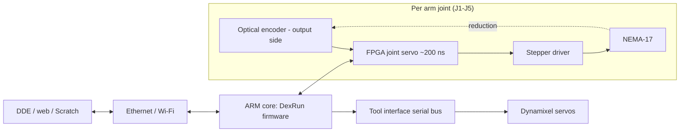

# 005 — Electronics and Control

This document specifies how Dexter senses, actuates, and is commanded: the optical encoders, the
stepper and servo actuation, the FPGA joint-servo loop, the controller boards, power, and the command
interface. It implements the electrical/control and interface requirements
([002](002-Requirements.md#5-electrical-and-control-requirements)) and drives the firmware configuration in
[006-Firmware-and-Calibration.md](006-Firmware-and-Calibration.md).

## Control architecture

The defining feature is a **fast local closed loop**: each arm joint's output-side encoder feeds the FPGA,
which adjusts the stepper to drive the *measured* joint position to the commanded position, with
encoder-to-motor response on the order of **200 ns** (REQ-CTL-1). The ARM core running **DexRun** sits above
this loop — it generates trajectories, runs onboard kinematics, applies calibration, and serves the network
interface — but does not run the tight servo loop itself. Because the loop is fast relative to the arm's
mechanical bandwidth, small sensor perturbations are filtered out mechanically (motor inertia and
inductance) rather than causing jitter.

*Source: wiki `Gateware.md`, `Joints.md`; system control diagram (`haddingtondynamics.github.io`).*

## Sensing

Each of the five arm joints carries a **custom optical encoder on the output side of the drivetrain**, so it
measures the *true joint angle* after any drivetrain compliance or backlash (REQ-PRE-1). Each encoder is a
printed **code disk** with radial slots read by LED/phototransistor **opto blocks**; interpolation between
slots yields ≈ 10⁶ counts/revolution (≈ 1.3 arcsec/count, REQ-PRE-2). The code-disk slot count differs per
joint — the per-joint values are in [003](003-Kinematics.md#joint-definitions).

- **Index/home sensing.** Beyond incremental counts, the disks carry index features the firmware scans on
  boot to find home ("index eyes"). The mapping from raw eye readings to joint position is established by
  calibration and recorded per unit ([006](006-Firmware-and-Calibration.md#calibration-model)).
- **Eye calibration.** Each opto block has trim potentiometers set so its two phototransistor channels
  trace a centered circle as the disk turns; this centers the "eye" and is part of the factory procedure.
- The encoder→position relationship absorbs imperfect slot geometry: calibration maps commanded position to
  observed reading, so disk imperfections are effectively removed rather than becoming position error.

*Source: wiki `Encoders.md`, `Encoder-Calibration.md`, `Joints.md`.*

## Actuation

| Axis | Actuator | Drive |
|---|---|---|
| J1–J5 | **NEMA-17 stepper, 0.9°/step (400 steps/rev)**, 16× microstepping | Motor Control PCB stepper drivers, closed by the FPGA loop |
| Tool roll, grip | **Dynamixel smart servos** | Serial (Dynamixel) bus over the tool interface |

Steppers are the motive source for all five arm joints; the FPGA's output-side correction is what turns an
open-loop stepper into a precise closed-loop joint. The tool axes use Dynamixel servos with their own
internal control, commanded over the tool interface serial bus. *Source: wiki `Hardware.md`, `Joints.md`,
`End-Effector-Servos.md`.*

## Boards

| Board | Role | Source of record |
|---|---|---|
| **Motor Control PCB** | Stepper drivers, power distribution, opto/tool connectors, FPGA carrier interface | `Hardware/Motor PCB/` gerbers and BOM; schematic `Hardware/09011-00135-A.PDF` |
| **MicroZed FPGA/SoC** | Xilinx Zynq module: FPGA fabric (joint servo, gateware) + ARM core (DexRun, Linux) | [C-701](007.1-Parts-Catalog.md#7-electronics-and-wiring) for the exact module part number |
| **Optical boards (×5)** | LED + phototransistor opto pickups, one per joint encoder | `Hardware/Opto/` gerbers/BOM |

- **Motor Control PCB.** No Motor Control PCB design of this version's own exists; the
  previous version's "green" board is reused (`09051-00135-A`, the revision carrying the D3/D4 power fix).
  Its gerbers, BOM, and schematic define the board of record:

  | Function | Devices | Note |
  |---|---|---|
  | Stepper drivers | 6 × Allegro **A4983** (`Z1–Z6` on `MOT1–MOT6`) | 5 arm joints + 1 spare/External channel |
  | Logic rails | TI **TPS54541** bucks — `U1` → 5 V, `U2` → 3.3 V | Bucked from the input rail `PMAIN`, ahead of the boost |
  | Boost | **LTC3786** (`U3`) | Raises `PMAIN` to the motor rail `PMOTOR` that feeds the drivers; its 38 V ceiling is the board's **input** ceiling |
  | Input series Schottky | **MBR30H100MFS** (`D6`), 100 V | Carries the whole board current in from `J24` |
  | Buck catch diodes | **PDS760** Schottkys (`D3`, `D4`), 60 V | One per TPS54541; the "D3/D4 fix" that defines this board revision |
  | Per-channel protection | 3.0 A thermal fuses (`F1`–`F6`) | One per motor channel; `F7` (1.0 A) fuses the fan |
  | Connectors | Mapped below | Generic, not tied to a specific robot version |

  **Connector map**, from the schematic. Channel order follows the firmware's axis order — Base, End,
  Pivot, Angle, Rotate — **not** joint number, so the Pivot and End channels cross over relative to their
  joint names ([003](003-Kinematics.md#joint-definitions)). Wire by name, never by connector number.

  | Ref | Type | Carries |
  |---|---|---|
  | `J1`–`J6` | 4-pin 0.1″ screw terminal | Stepper phases, pins 1–4 = A−, A+, B−, B+. `J1` Base, `J2` End, `J3` Pivot, `J4` Angle, `J5` Rotate, `J6` External (spare) |
  | `J7`, `J8`, `J10`–`J13` | 1 × 6 0.1″ header | Opto boards, pins 1–6 = A−, A+, B−, B+, supply, ground. `J7` Base, `J8` Rotate, `J10` Angle, `J11` Pivot, `J12` End, `J13` External |
  | `W1`, `W2` | 0 Ω jumper | Selects the opto supply — `W1` 5 V, `W2` 3.3 V. **Fit exactly one** |
  | `J9`, `J18` | 2 × 50 0.8 mm | MicroZed carrier: `JX2` (analog and encoder) and `JX1` (digital) |
  | `J14`–`J17` | 1 × 3 2 mm right-angle | Differential analog inputs `ANA_1`–`ANA_4` |
  | `J19` | 1 × 7 2 mm right-angle | Debug port; pin 7 is the `GripperMotor` output |
  | `J20`, `J21` | 1 × 2 2 mm right-angle | FPGA `AUX1` and `AUX2` pairs through 33.2 Ω series resistors; the tool's Green and Blue land on `J20` ([Tool interface wiring](#tool-interface-wiring)) |
  | `J22`, `J25` | 1 × 2 0.1″ header | `J25` is the tool's logic pair — ground and +5 V |
  | `J23` | 1 × 2 2 mm right-angle | Cooling fan, through `F7`; the schematic annotates the load `12V FAN` ([C-716](007.1-Parts-Catalog.md#7-electronics-and-wiring)) |
  | `J24` | 4-pin 0.1″ screw terminal | Main power in, pins 1–4 = `VIN1` "+", `GND1` "−", `VIN2` "+", `GND2` "−" |

  `J20`, `J21` and `J23` take the same mating connector.

  The generic connector set is why the reuse is viable: the only known difference from the previous version
  is the wiring-harness reassignment described in [Tool interface wiring](#tool-interface-wiring), not a
  board change. A purpose-built board is a roadmap item ([011](011-Roadmap.md)); what remains to close the
  reuse is [DC-7](009-Design-Completion.md#motor-control-pcb).
- **Gateware.** The FPGA logic (the servo loop and interconnect) is authored in a graphical logic tool
  (Viva/Azido) and deployed as a bitstream; it is largely a compiled artifact rather than edited source.
  Operating "modes" (follow/helping-hand/keep-position, etc.) are FPGA configurations selected at runtime.

## Power

A single DC supply feeds the motor and logic rails through the Motor Control PCB (REQ-CTL-5). The supply of
record is **36 V DC, 4 A (≈144 W)** — a standard laptop-style DC brick with a matching barrel connector.

The **38 V board ceiling** set by the `LTC3786` ([Boards](#boards)) is what bounds the supply from above;
36 V sits just under it with margin, and the board's 50 V-rated input capacitors and the 100 V `D6` input
Schottky support it. The motor rail `PMOTOR` feeds the six A4983 stepper drivers (≈2 A/phase, fused at
3.0 A per channel); the TPS54541 bucks derive the logic rails from the input rail ahead of the boost. Servo
power for the tool is derived on the tool side.

**Under-voltage is a failure mode, not just a slowdown:** a 12 V or 24 V brick causes the arm to grind and
buzz, stall mid-motion, and fail to find home. Do not substitute one. *Source: wiki
`Troubleshooting.md`; Motor PCB BOM (`Hardware/Motor PCB/09011-00135-A.BOM`);
[LTC3786 datasheet](https://www.digikey.com/en/products/detail/analog-devices-inc/LTC3786IUD-PBF/2407353).*

## Command interface

Dexter is commanded over the network by the **oplet protocol**: single-letter command primitives sent
over a socket to DexRun (e.g. `a` move-all, `M`/`T` Cartesian moves, `S` set-parameter, `g` get-status,
`r` read, `w` write). The motion oplets are specified in [003](003-Kinematics.md#motion-commands).

| Interface | Description | Requirement |
|---|---|---|
| **Socket / oplet protocol** | Raw TCP socket to DexRun carrying oplets; the lowest-level control interface | REQ-IF-1 |
| **DDE** | Dexter Development Environment: JavaScript kinematics/motion API, GUI + onboard Job Engine for headless runs | REQ-IF-2, REQ-PRG-1 |
| **Onboard web server** | Node.js web server / editor for browser access without installed software | REQ-IF-5 |
| **PhUI** | Physical teach-and-replay; the default startup job, whose effect on network control is specified in [006](006-Firmware-and-Calibration.md#boot-and-phui) | REQ-PRG-2 |
| **Scratch** | Block-coding extension for simple fixed motions | REQ-PRG-3 |
| **SSH / USB console** | Service and calibration access | REQ-IF-3 |

*Source: wiki `DexRun-DDE-communications.md`, `Command-oplet-instruction.md`, `DDE.md`,
`nodejs-webserver.md`, `PhysicalUserInterface.md`, `Scratch-extension.md`.*

## Tool interface wiring

The tool interface connects to the Motor Control PCB through **6 conductors** (REQ-IF-4). Five assignments
are common across versions; **the White conductor changed with this version** and the difference is
safety-relevant.

| Wire | Assignment | Lands on | Note |
|---|---|---|---|
| Black | Ground | `J25` pin 1 (top) | |
| Red | +5 V logic | `J25` pin 2 (bottom) | |
| Yellow | Unregulated supply power | `J24` pin 1 — the "+" slot | Tapped from the board's own DC input |
| Blue | Servo data bus | `J20` bottom pin (`AUX1_N`) | |
| Green | Auxiliary / return serial data | `J20` top pin (`AUX1_P`) | |
| **White** | **Second ground** | `J24` pin 2 — the 2nd-from-top "−" slot | **On the previous version this same wire can carry regulated servo power (6–8.75 V)** |

**Safety.** On the previous version, White may carry 6–8.75 V; here the same physical wire and terminal are
a second ground. Connecting an older harness to a board configured for this version (or vice versa) without
re-checking this assignment shorts a power rail to ground. Before first power-on, confirm White lands on
`J24` pin 2 and that nothing at the tool end drives it. *Source: wiki `End-Effectors.md` ("Version 2
Wiring"); schematic `Hardware/09011-00135-A.PDF` for the landings above.*

## Open items

Nothing else in this document is open.

| Item | What is open |
|---|---|
| Motor Control PCB | Physical power-on test of the reused board — [DC-7](009-Design-Completion.md#motor-control-pcb) |
| Cooling fan over the stepper drivers | Size and part number — [DC-11](009-Design-Completion.md#procurement-data) |
