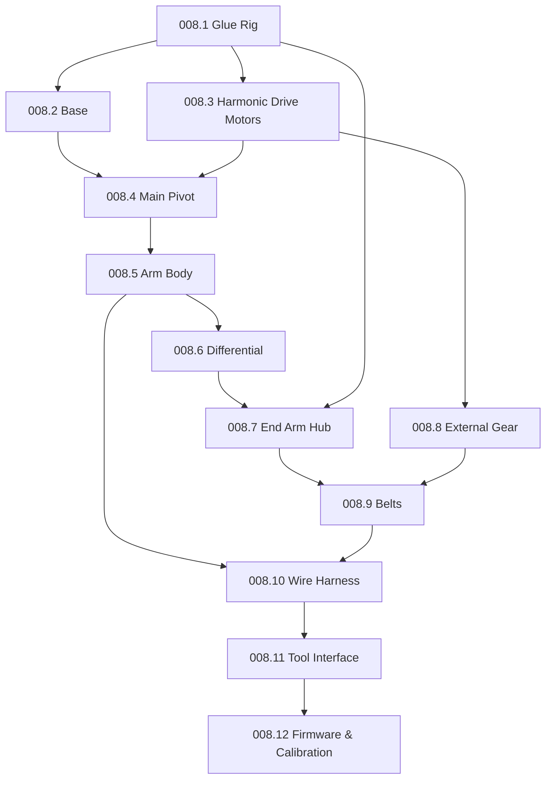

# 008 — Assembly

This document is the procedure that builds the parts in [007-Bill-of-Materials.md](007-Bill-of-Materials.md)
into the robot specified in [004-Mechanical-Architecture.md](004-Mechanical-Architecture.md). It is a
**derived artifact** — regenerate it when the mechanical design changes. Steps for `[Provisional]`
subassemblies (the bolted base, the differential substitute, the revised link lengths) are the current
procedure of record; confirm the corresponding [009-Design-Completion.md](009-Design-Completion.md) item
before committing irreversible work (cutting CF, pressing strain-wave splines). A from-scratch build ends
with the firmware/calibration bring-up in [008.12](#00812-firmware-configuration-and-calibration).

## Assembly order

## General tools and consumables
- Two-part epoxy; cyanoacrylate ("super") glue; hot glue gun; threadlocker (e.g. Loctite 243)
- Rubber mallet; a short aluminum strake as a bearing drift; bearing/arbor press (for strain-wave flex-spline
  pressing)
- Wave-generator depth-setting tool (a shop-made depth gauge; confirm form during 008.3)
- Cordless drill with small chuck (reaming; improvised reamer from cut pin stock)
- Soldering iron, solder, heat-shrink, wire strippers
- Phillips and small flathead screwdrivers (the flathead spins M2 nuts too small for a wrench)
- **Grounded anti-static wrist strap** whenever handling the FPGA board (present from 008.10 onward)
- WinSCP and PuTTY (or equivalent) for 008.12

**Conventions.** The bonding, tightening, and torque conventions in
[004 § Materials and construction methods](004-Mechanical-Architecture.md#materials-and-construction-methods)
apply to every step below and are not repeated per step.

---

## 008.1 Glue Rig Assembly
Parts: [007.1](007-Bill-of-Materials.md#0071-glue-rig-assembly). Builds two epoxy jigs (tooling, not robot
parts) that hold parts square while adhesive cures.

1. Assemble one "top rig" and one "bottom rig," one at a time.
2. Clear all mating surfaces of first-layer print residue before gluing.
3. Dry-fit every part on the rig before applying epoxy.
4. Use a CF strake to lock the Axis Intersection so it cannot shift while curing.
5. Apply epoxy to both mating surfaces of each joint; do not over-apply — wipe excess before cure.
6. Confirm parts sit flush and level; weight them if needed.
7. Cure per the epoxy manufacturer's time before removing.

## 008.2 Base
Parts: [007.2](007-Bill-of-Materials.md#0072-base). `[Provisional]` — steps 1 and 4 wait on the plate's
robot-side hole pattern ([DC-4](009-Design-Completion.md#base-plate)); the remaining steps are established.

1. **(Blocked on [DC-4](009-Design-Completion.md#base-plate))** Bolt the Base Mounting Plate to the Base
   Mount Bottom, per the plate's final robot-side bolt pattern.
2. Epoxy the 133 mm CF strakes into the Base Mount Bottom and Base Long, filling every other slot — the two
   parts slide together and lock.
3. When epoxying the Base Long, leave the strakes protruding ~6 mm (1/4") so the Base Code Disk has a surface
   to rest against.
4. **(Blocked on [DC-4](009-Design-Completion.md#base-plate))** Bolt the assembled Base Mounting Plate to the
   work surface through its 4 × M6 holes. This is the sole mounting method, and the plate must be bolted
   down rather than left resting — see
   [004 § Base mounting plate](004-Mechanical-Architecture.md#base-mounting-plate).
5. Assemble each Base Clamp: place an M3 washer on the hex side and thread in an M3 × 20 mm bolt from the
   other side. Assemble **both** clamps (the clamps are installed later, in [008.4](#0084-main-pivot) step
   18).

## 008.3 Harmonic Drive Motors
Parts: [007.3](007-Bill-of-Materials.md#0073-harmonic-drive-motors). Builds the base (J1) and pivot (J2)
motor assemblies (repeat for the J3 external-gear motor in [008.8](#0088-external-gear)).

1. Assemble one drive at a time.
2. Keep each strain-wave drive's top and bottom halves paired — they are matched at manufacture and are not
   interchangeable between drives.
3. Remove first-layer print residue from the Flex Spline Attach.
4. Lubricate, then press the flex spline onto the Flex Spline Attach with a press.
5. Separate them and inspect for print residue pushed into the attachment nubs during pressing; remove any.
6. Secure the Flex Spline Attach to the motor with 4× M3 × 10 mm bolts (confirm size/qty against the build).
7. Tighten the M2 bolts into the Flex Spline Cap until ~1/4" of thread shows through the far side.
8. Press M3 nuts into the Wave Gen Coupler, insert M3 × 8 mm hex bolts to retain them, then epoxy over the
   nut heads to lock them; cure.
9. Ream the Wave Gen Coupler and lubricate before sliding it onto the motor shaft.
10. Use the wave-generator depth-setting tool to set the coupler depth on the shaft.
11. Tighten the M3 × 8 mm hex bolts evenly (alternate a few turns each) until snug — do not over-tighten the
    printed mount.

## 008.4 Main Pivot
Parts: [007.4](007-Bill-of-Materials.md#0074-main-pivot). Consumes 2× motor assemblies from
[008.3](#0083-harmonic-drive-motors) and the Base from [008.2](#0082-base).

1. Epoxy the 126 mm CF strakes to the Main Pivot's short end and the 146 mm strakes to the long end; epoxy
   both the body holes and strake ends.
2. Epoxy both ends at once — internal weep holes connect them and epoxy mixes inside; wipe weeped excess.
3. Confirm both strake sets protrude by about the same distance once seated.
4. Press the Pivot Motor End Caps onto two 6810 bearings.
5. Slide the two-sided Pivot Code Disk onto the Main Pivot, flat side facing away from the body.
6. Epoxy the Pivot Motor End Caps to the Main Pivot; orient the long-end cap's notch toward the motor-wire
   hole in the long end (short-end cap orientation is free — its wire hole is centered).
7. Feed the two motor assemblies' wires through the side holes and pull them through.
8. Epoxy the motor bottoms, End Cap faces, and the strake-to-motor contact areas.
9. Mount the Main Pivot onto the Base:
   a. Press a 6810 bearing ~38 mm (1.5") into the Base Long (mallet + aluminum drift if it resists).
   b. Align the Base Code Disk with the 3 strakes and press to snap in.
   c. Push the Base Long (wires up) onto the Main Pivot until fully seated; if the bearing pushes out, invert
      and tap back.
   d. Remove the Flex Spline Attach socket-head screws one at a time, adding a #6 washer under each to hold
      the bearing and lock the motor while adhesive cures.
10. Lubricate 4× M2 × 16 mm bolts, place them in the Base Stator Holder, and screw down.
11. Seat the strain-wave top in the Base Stator Holder, stamped "52" outward, aligning the two threaded
    holes; secure with 2× M3 × 12 mm socket-head bolts.
12. Slide the Base Stator Holder onto the Base Long strakes, pressing down while occasionally rotating the
    motor shaft.
13. Prepare 3× M3 × 105 mm all-thread: apply threadlocker, thread an M3 nut flush at one end.
14. Slide the Base Stator Holder fully onto the strakes.
15. Slide the 3 all-thread rods into every other hole of the Base Stator Holder.
16. Set the Base Long onto the Base Mount and rotate until the Main Pivot notch lines up with the rods.
17. Add a #6 washer and M3 nut onto each rod and tighten (all 3), keeping the notch aligned.
18. Install **both** Base Clamps (from [008.2](#0082-base) step 5), stacked: remove the Base Long, slide both
    clamps onto the Base Mount, reinstall the Base Long, and tighten both clamps. Confirm the stacking
    order/spacing against a physical build.

## 008.5 Arm Body
Parts: [007.5](007-Bill-of-Materials.md#0075-arm-body).

1. Press a 6810 bearing ~38 mm into the Arm Body.
2. Slide the Arm Body over the Pivot Motor and snap in; tap the bearing back with mallet + drift if it backs
   out.
3. Remove the M3 × 12 mm socket-head screws one at a time, adding a #6 washer under each, and retighten to
   lock the bearing.
4. Lubricate 4× M2 × 16 mm bolts in the Pivot Stator Holder and screw down.
5. Seat the strain-wave top in the Pivot Stator Holder, "52" outward, aligning the threaded holes; secure
   with 2× M3 × 12 mm socket-head bolts.
6. Slide the Pivot Stator Holder onto the Arm Body, pressing while rotating the motor shaft.
7. Tap the 4 Stator Balancers into place with light mallet taps (they are fragile).
8. Assemble the Belt Directors:
   a. Press the 6 MR128 bearings into the belt director bodies.
   b. Apply a drop of super glue **inside** each Belt Director (not on the cap — cap glue can seep into and
      lock the bearing).
   c. Push the Large and Small Belt Directors through front to back, then press the Caps in from the back.
9. Idler: fit the MR85 bearing onto the Idler Plug shaft, then screw in the M2 × 20 mm bolt back to front.
10. Hold the Belt Director Pulley between the two halves, push the Idler Plug through back to front, and press
    together.
11. Place the M3 washer, then M2 washer, then M2 nut, and tighten.

## 008.6 Differential
Parts: [007.6](007-Bill-of-Materials.md#0076-differential). `[Specified]` —
[DC-2](009-Design-Completion.md#differential-detail-design); parametric source in
[`Hardware/Models/700-Differential/`](../Hardware/Models/700-Differential/).

**Before printing:** choose the parameter set. `config="previous"` builds the previous version's proven
differential (does not fit the `HDI-940` covers — omit or re-cut them); `config="revised"` fits the covers
([004 § Differential interface](004-Mechanical-Architecture.md#differential-interface)) but is unproven on
a physical build until the DC-9 checklist passes. The former `710-002` scale defect is resolved
([DC-11(f)](009-Design-Completion.md#procurement-data)).

1. Insert one 6705 and one 6703 bearing into Diff Body A; press to seat.
2. Insert one 6703 into the End Arm Hub; press to seat.
3. Insert 2× 6703 into Diff Body B (one each side); press to seat.
4. Insert 2× MR128 into the Diff Gear Shaft (one each end); press to seat.
5. Insert one 6703 and one MR128 into the Split Gear Top (fitted locations); press.
6. Insert one 6703 and one MR128 into opposite sides of the Split Gear Bottom; press.
7. Ream the 4 side holes of the Split Gear Top ~6 mm deep.
8. Press the Split Gear Top into the Split Gear Bottom; rotate until the 4 holes show through the 4 windows.
9. Through each window, insert a 1" #19 wire brad with super glue ~6 mm deep; trim flush once set.
10. Push a zip-tie flat end into each window as far as it goes, hot-glue, and trim flush.
11. Epoxy the 3 25 mm CF strakes into the Split Gear Bottom slots; cure.
12. Press the Diff Gear Shaft into Diff Body B.
13. Press Diff Body B into Diff Body A (tight, fully seated).
14. Feed all 6 tool wires through Diff Body B: Red/White/Blue through the top entrance and out one side of the
    shaft; Black/Green/Yellow through the bottom and out the other side (only 3 fit per channel). Confirm the
    wires slide freely before continuing.
15. Feed the shaft wires through the assembled Split Gear and slide it down to meet Diff Body B.
16. Lightly sand one end of the 96 mm CF rod; epoxy the Diff End Pulley 6 mm from the tip, protruding side
    toward the rod's long side.
17. Confirm the 6703/MR128 bearings are seated so the shaft end protrudes ~1 mm past the 6703.
18. Super-glue and snap the Diff Axle Keeper over the shaft end, against the 6703.
19. Press the MR85 into the flat back of the Diff Gear Axle, ~1 mm proud.
20. Sand the other rod end and epoxy the Diff Gear Axle onto it.
21. Insert the CF rod through the Diff Gear Shaft until it stops.
22. Hand-turn the Split Gear to confirm free rotation.
23. Slide one AS thrust race over the wires and Diff Body B shaft, then the AXK0819, then the second race.
    Epoxy only the chamfered edge of a Diff Keeper (apply sparingly with a nail), feed the wires through, and
    join to Diff Body B.
24. Clamp a second Diff Keeper on top of the epoxied one until cured.

## 008.7 End Arm Hub
Parts: [007.7](007-Bill-of-Materials.md#0077-end-arm-hub).

1. Insert a 6810 bearing into each Axis Intersection half.
2. Press the New Belt Pulley into the Arm-Body-side half.
3. Epoxy the holes on the Arm-Body-side Axis Intersection.
4. Epoxy the mirrored other half and join the two; epoxy the remaining holes for the 48 mm strakes.
5. Slide the 48 mm CF strakes in, wipe excess, clamp in 2 places, and cure — periodically spinning the New
   Belt Pulley to confirm it turns freely.
6. Epoxy the 3 81 mm CF strakes into the Internal Inner Pulley slots, flush with the face; keep the flush
   side clean.
7. Press 2 6703 into one side of the New Belt Pulley and 1 into the other; seat fully.
8. Align the End Arm Hub's 4 back holes with the 4 nubs on the assembled New Belt Pulley and push together.
9. Slide the Internal Outer Pulley onto the 113 mm stainless rod, set screws toward the rod's long end, and
   lock 3.1 mm from the end; tighten set screws incrementally and evenly.
10. Slide a Pulley Spacer between the Internal Inner and Outer Pulleys and join them.
11. Feed the rod/pulley through the End Arm Hub connection as far as it goes.
12. Prepare 4× M3 × 107 mm all-thread: thread on 2 M3 nuts and 1 washer at one end, flush.
13. Place the End Arm Code Disk on the outside of the Axis Intersection hub, raised side in.
14. Thread one rod into the End Arm Hub until it protrudes slightly through the code disk; add an M3 washer
    and jam nut.
15. Add a second washer and jam nut with threadlocker, flush with the rod end. The External Inner Pulley must
    clear all 4 jam nuts and rods — a standard M3 nut is too thick and will foul the pulley.
16. Epoxy 3 M3 nuts into the Internal Outer Pulley slots and 3 into the External Outer Pulley slots; cure.
17. Thread 6 M3 × 6 mm set screws into the epoxied nuts, flush with the nut ends.
18. Break the connection between the paired end nuts on each rod, add an M3 washer, and snug the inner nut
    without over-tightening.
19. Snap the End Arm Hub Cap into place.
20. Press one MR128 into the Internal Outer Pulley end and another into the End Arm Hub Cap.
21. Slide the External Inner Pulley onto the stainless rod until it stops.
22. Add the second Pulley Spacer, then the External Outer Pulley.
23. Tighten the 3 External Outer Pulley set screws, applying pressure from both sides while tightening evenly.
24. Press 2 MR128 into the Front Panel shaft hole (relieve the first print layer if the bearings distort or
    crack the opening).
25. Seat the Front Panel's bottom saddle onto the Arm Body protrusion, over the stainless rod shaft.
26. Epoxy the concave inner face of a Diff Keeper and join it to the Front Panel.

## 008.8 External Gear
Parts: [007.8](007-Bill-of-Materials.md#0078-external-gear). Builds the 3rd strain-wave drive (J3) — follow
[008.3](#0083-harmonic-drive-motors) steps 1–11 for the drive, then:

1. Place 4 M3 nuts into the hex nut holders on the Ex Gear Motor End Cap.
2. Screw M3 × 10 mm bolts into those nuts from the underside.
3. Feed the motor wires through the End Cap.
4. Epoxy the motor bottom and End Cap top and join, aligning the notch with the wire exit; then pull the
   bolts away from the End Cap so the nuts seat inward.
5. Press one 6810 ~38 mm into the External Gear (tap back if it pushes out); press the second 6810 into the
   top.
6. Replace the temporary bolts one at a time with M3 × 12 mm socket-head bolts and #6 washers, cross-pattern.
7. Mount the strain-wave top to the Ex Gear Stator Holder: "52" outward, threaded holes aligned, lubricate
   the bolt shafts, secure with 2× M3 × 12 mm socket-head bolts.
8. Slide the Ex Gear Stator Holder onto the External Gear, aligning the notches, pressing while rotating the
   shaft until hand-tight.
9. Place M3 nuts into Nut Holder A/B, slide into the Ex Gear Mount (curvature sets orientation), seated to
   accept the all-thread.
10. Feed the motor wires through the Ex Gear Mount hole, slide onto the strake holes, press hand-tight.
11. Install 4× M3 × 12 mm socket-head bolts to secure the External Gear.
12. Thread 2 M3 nuts onto one end of an M3 × 46 mm all-thread, tightened together.
13. Fit the Ex Gear Mount Top over the External Gear, insert the all-thread, and tighten.
14. Install the angle and rotate motors: feed each shaft back to front through the mount, wires toward the arm
    shaft.
15. Place M3 washers on 4× M3 × 8 mm bolts, insert through the mount front, tighten cross-pattern until each
    motor seats fully (no aluminum body exposed) — do not over-tighten the aluminum receivers.

## 008.9 Belts
Parts: GT2 belts/pulleys from [007.7](007-Bill-of-Materials.md#0077-end-arm-hub) and
[007.8](007-Bill-of-Materials.md#0078-external-gear). `[Provisional]` — the driven pulleys are set by
[DC-3](009-Design-Completion.md#wrist-reduction-ratio); verify J4/J5 resolution empirically after
calibration.

1. Slide the 2 16T × 5 mm GT2 pulleys onto the external motors.
2. Before tightening the set screws, confirm the belts line up with the belt directors above.
3. Tighten one set screw against the flat of each motor shaft.

## 008.10 Wire Harness
Parts: [007.10](007-Bill-of-Materials.md#00710-wire-harness). Uses the previous version's Motor Control Board
([DC-7](009-Design-Completion.md#motor-control-pcb)).

1. Snip the M2 connection on the back of the Motor Control Board to break it.
2. Place the FPGA (MicroZed) board on the Motor Control Board and snap in.
3. Slide the microSD into the FPGA board until it locks (press again to release).
4. Align the PCB spacers with the bolt holes; feed 4× M3 × 20 mm bolts through the FPGA board, spacers, and
   out the back of the Motor Control Board.
5. Epoxy the bottom PCB bracket 37.5 mm up from the Arm Body joint — this sets the top bracket position too.
6. Hold the Motor Control Board with the brackets on the opposite side of the 1" CF tube and screw in the
   M3 × 20 mm bolts without over-tightening (an M3 nut can back up a stripped hole).
7. Connect the power wires: black to negative (−), red to positive (+).
8. **Tool-interface wiring:** connect the White signal wire to the **2nd ground terminal** (labeled "−"
   near the top of the motor board). Verify this assignment against the board before first power-on — the
   cross-version hazard it guards against is specified in
   [005 § Tool interface wiring](005-Electronics-and-Control.md#tool-interface-wiring).

## 008.11 Tool Interface / Gripper
Parts: [007.11](007-Bill-of-Materials.md#00711-tool-interface--gripper).

1. Dry-fit the 25 mm CF strake in the Span Mount's triangular top slot.
2. Epoxy the 25 mm strake into the Span Mount slot until its top is flush with the Span Mount notch and flush
   with the inner surface at the bottom.
3. Slide 3 M3 nuts into the Tool Interface Body outer slots, align by threading M3 × 10 mm bolts into the 3
   outer holes, then force a little epoxy into the holes above the nuts to lock them.
4. Press 2 6703 bearings into each side of the Roll Body.
5. Clip the head off a 1" #19 satin pin, chuck it, and ream the 4 smallest holes on the bottom of the Roll
   Driver.
6. Push 4 satin pins through the reamed holes ~6 mm proud, cut the heads, super-glue flush, trim and sand
   smooth.
7. Thread the 4 M2 × 20 mm bolts into the Roll Driver, leaving 2 diagonally-opposite bolts ~2 mm proud to
   engage the Span Mount holes.
8. Press the Roll Driver's flat side into the non-flat side of the Roll Body, flush with the far 6703 (tap
   gently if needed).
9. Identify the two servos (labeled 1 and 3); move the connector from motor 1 into motor 3.
10. Press the connectors into the groove on each motor's top edge and slide each motor into the Tool
    Interface Body until it snaps.
11. Mark the 3-pin connector with a sharpie: blue = data (left), red = power (middle), black = ground
    (right), viewed from the front (M3 × 10 mm bolt facing you); the opposite-side connector is mirrored.
12. Cut the 3 wires mid-connector on the right side (removing the top connector portion), feed them through
    the motor's middle hole toward the top of the body, and tin the ends.
13. Trim each wire to ~13 mm and strip ~6 mm.
14. From the front, the topmost servo wire is ground → black pin; middle is power → red; bottom is data →
    blue. The opposite side is mirrored.
15. Heat-shrink each connection as you solder it.
16. Feed 4× 25 cm lengths of 28 AWG (black, red, blue, green) through the Roll Driver center hole and press
    into the Span Mount groove.
17. Align and tighten the Roll Driver bolts into the Span Mount, keeping the wires seated, until slightly
    proud.
18. Thread an M2 washer and M2 nut onto each (use a flathead/hobby knife to spin the nut), holding while
    tightening.
19. Remove the motor-cap bolt **without turning the motor** (turning misaligns zero and forces a reset).
20. Feed the Roll Body wires into the motor's center hole without turning the motor; pull through until the
    Roll Driver nearly contacts the motor, matching the drive nubs near zero (Span Mount nubs on top at
    zero; the Span Mount Eye reads 90° when the Roll Body is pushed on).
21. Gently push the Roll Driver into the motor, rocking the Span Mount to confirm engagement.
22. Thread 2 M2 × 12 mm bolts into the Roll Body end holes with M2 nuts (leave the center empty).
23. Thread 4 M2 × 16 mm bolts through the remaining holes with M2 washers.
24. On the Span Motor (#1), remove the center screw and its plastic driver.
25. Align the motor driver with the Span Mount hole and push into the 2 nubs at the Span Mount base.
26. Fasten with 2 M2 × 12 mm bolts (right of the Span Mount), M2 washers, and M2 nuts.
27. Solder the Roll Motor's remaining connector with the same color scheme, then feed the 3 wires through the
    right servo hole toward the top of the body.
28. Trim to ~13 mm, strip ~6 mm; map top-to-bottom ground/power/data, this side mapping to blue/red/black
    directly.
29. Slip 1/4" heat-shrink over the black, red, blue wires exiting the body.
30. Solder matching colors, slide heat-shrink over each joint, and shrink.
31. Plug the cut-off connector into the back of the Span Motor; trim and solder the remaining wires.
32. Solder the original first connector's end to the Span Motor feed wires before connecting the Roll Motor;
    pull the joint taut away from the Span Motor first.
33. Repeat solder/heat-shrink for the remaining pairs.
34. Super-glue the wires exiting the Tool Interface base so Span Mount rotation cannot snag them.
35. Power the motors briefly to confirm they turn and their LEDs light.
36. Align the notch inside the Span Driver's bore with the motor's driver key.
37. Push the Span Driver into place and secure with an M2.6 × 10 mm bolt, snug (over-tightening strips the
    mount).
38. Clip a 1" #19 satin pin, chuck it, and ream the 2 small holes atop the Pinion Gear.
39. Super-glue satin pins into the reamed holes with needle-nose pliers, cure, trim flush, sand.
40. Place an M3 nut in the Pinion Gear.
41. Press the remaining 2 MR128 bearings into both sides of the Static Finger.
42. Slide the Pinion Gear into the Static Finger, horseshoe cutout toward the opening.
43. Align the Pinion Bearing EXT with the short hash mark on the Pinion Gear (fits one way) and secure with an
    M3 × 16 mm bolt, loose enough to still turn freely.
44. Turn the Span Driver until its flat faces forward, horseshoe toward you — the gripper's open position.
45. Turn the Pinion Gear until the Pinion Bearing EXT hash aligns with the long hash on the Static Finger.
46. Push the Static Finger onto the Span Mount so the 25 mm strake seats into its Span Mount hole.
47. Slide the Dynamic Finger into the Static Finger and close fully.
48. Cut two yoga-mat pieces to the finger inside faces and hot-glue them as grip pads.

## 008.12 Firmware Configuration and Calibration
Config: [006-Firmware-and-Calibration.md](006-Firmware-and-Calibration.md). Required before first use on a
from-scratch build.

1. Set `Defaults.make_ins` per [006](006-Firmware-and-Calibration.md#firmware-defaults-defaultsmake_ins) —
   the `AxisCal`/`Interpolation` values (already the active defaults) and the correct `LinkLengths` for the
   physical build.
2. Determine whether this build needs calibration, per the policy in
   [006 § Calibration model](006-Firmware-and-Calibration.md#calibration-model). A **from-scratch build**
   runs the full [factory calibration procedure](006-Firmware-and-Calibration.md#factory-calibration-procedure);
   a build reusing an already-calibrated unit's electronics does not. This is the one step hardest to
   recover from if done wrong — read that section before starting.
3. Configure `RunDexRun` per [006](006-Firmware-and-Calibration.md#factory-calibration-procedure) step 3.10
   so the robot finds home and starts PhUI on boot.
4. Power-cycle and confirm the boot sequence completes as specified in
   [006 § Boot and PhUI](006-Firmware-and-Calibration.md#boot-and-phui).
