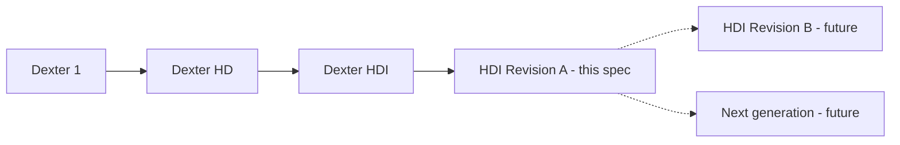

# 010 — Versioning and Roadmap

This document governs how the Dexter specification evolves: the generation lineage that produced Dexter
HDI, the revision model by which successive versions are derived from the current baseline, and the forward
roadmap of intended improvements. It is the meta-specification — it specifies how to change the
specification.

## 1. Generation lineage

Dexter is a line of robots. Each generation is a distinct machine: parts, geometry, drivetrains, and
firmware constants differ, and generations are not interchangeable.



| Generation | Body material | Wrist J4/J5 resolution | Base | Calibration model |
|---|---|---|---|---|
| Dexter 1 | PLA (FDM) | Microstep oscillation | Free-standing | Field-calibrated |
| Dexter HD | Onyx / carbon-fiber | Microstep oscillation (firmware `Interpolation` 16×) | 6-leg strake base, single clamp | Field-calibrated |
| **Dexter HDI** | Onyx / carbon-fiber | **Belt/pulley reduction** (`Interpolation` 1×) | **Bolted base, double clamp** | **Factory-recorded, not re-calibrated in field** |

Dexter HDI is a revision of the HD architecture, not an unrelated design; this is why the HD design serves
as the inherited baseline for any HDI subassembly whose HDI-specific design is not independently
established. The concrete HD→HDI deltas are specified where they apply:
[003-Kinematics.md](003-Kinematics.md#link-lengths) (link geometry),
[004-Mechanical-Architecture.md](004-Mechanical-Architecture.md) (base, wrist, differential),
[005-Electronics-and-Control.md](005-Electronics-and-Control.md) (wiring), and
[006-Firmware-and-Calibration.md](006-Firmware-and-Calibration.md) (drive constants, calibration policy).

## 2. Design identity

The current baseline is **Dexter HDI — Design Revision A** ("HDI Rev A"). A design identity has three parts:

- **Generation** — the machine family and architecture (Dexter HDI).
- **Revision** — a lettered issue of that generation's design of record (Revision A, B, …). A new revision
  is a change to the *specified design* of the same generation: it may change parts, geometry, firmware, or
  procedure, but stays within the HDI architecture.
- **Build/serial** — an individual physical robot built to a revision (e.g. a unit carrying its own
  factory calibration record, analogous to the serialized `HDI-007010` unit whose measured kinematics
  seed [003-Kinematics.md](003-Kinematics.md)). Serials are not spec versions; they are instances.

A change large enough to break the HDI architecture (a different reduction principle on the base joints, a
different sensing method, a different control platform) is a **new generation**, authored as a new spec set,
not a revision.

## 3. Revision model — how to derive the next version

Revision A is written so the next revision is a **delta against it**, not a rewrite. To author Revision B
(or any successor):

1. **Branch the spec set.** Copy `specs/` to the new revision's working area (or a git branch). Revision A
   remains the frozen reference.
2. **Open a change set.** Create `specs/CHANGES-RevB.md` listing each intended change as a delta:
   the requirement or design item it modifies (by document and section), the old design, the new design,
   and the rationale. This is the human-readable diff between revisions.
3. **Amend requirements first.** Apply changes that alter *what the robot must do* to
   [002-Requirements.md](002-Requirements.md). Requirements are the root of the derivation; change them
   before touching mechanics.
4. **Re-derive downstream.** Propagate each requirement change through kinematics (003), mechanical
   architecture (004), and electronics/control (005), then regenerate the derived artifacts — firmware
   configuration (006), bill of materials (007), and assembly (008). The dependency order is:
   `002 → 003 → 004 → 005 → {006, 007, 008}`.
5. **Carry forward open decisions.** Any [009-Design-Completion.md](009-Design-Completion.md) `[TBD]` item
   still open at the time of branching is inherited by the new revision unless the change set closes it.
6. **Re-mark design status.** A `[Specified]` item whose design the revision changes reverts to
   `[Provisional]` until re-validated on a physical build of the new revision. Do not carry a prior
   revision's validation forward across a design change.
7. **Record the lineage.** Add the new revision to the table in §1 and note, in
   [001-Overview.md](001-Overview.md#5-design-lineage), what changed from the previous revision.

The same procedure applies whether the successor is a modest Revision B (e.g. a redesigned differential) or
the seed of a new generation (in which case step 1 starts a new spec set rather than a revision branch).

## 4. Change-set record format

Each change in a `CHANGES-*.md` delta uses this shape, so revisions remain auditable:

```
### CR-<n>: <short title>
- Affects: <doc §section> [, <doc §section> …]
- Was: <the Revision A design>
- Now: <the new design>
- Driver: <requirement / defect / improvement that motivates the change>
- Status: [Specified | Provisional | TBD]
- Re-derive: <downstream artifacts to regenerate: 006/007/008 as applicable>
```

## 5. Roadmap

Improvements anticipated beyond Revision A, in rough priority order. Each becomes one or more change
requests when a revision is opened. Items that are *decisions required to finish Revision A itself* live in
[009-Design-Completion.md](009-Design-Completion.md), not here; the roadmap is for improvements *beyond* a
complete Revision A.

1. **Validate Revision A on a physical build.** Promote the `[Provisional]` items in 004–008 to
   `[Specified]` by building and measuring one unit; feed corrections back into the specs. This is the
   precondition for every later roadmap item.
2. **Close the strain-wave and differential open designs** as validated designs (they enter Revision A as
   `[TBD]`/`[Provisional]`; see [009](009-Design-Completion.md)), so the base joints and wrist are fully
   specified rather than inherited.
3. **HDI-native Motor Control PCB.** Replace the inherited HD board (used provisionally in Revision A, see
   [005](005-Electronics-and-Control.md#boards)) with a board designed to the HDI wiring and wrist-drive
   requirements.
4. **Documented, parametric CAD.** Bring the mechanical design under a single parametric CAD source so link
   lengths and reductions can be re-derived per revision rather than hand-adjusted.
5. **Generalized task programming.** A task-learning layer (policy that generalizes across object
   positions and tasks) on top of the socket/oplet protocol. Out of scope for the base robot; a candidate
   new subsystem specified in its own document if pursued.
6. **Payload, speed, and reach envelope characterization.** Measure and publish the performance figures
   that [002-Requirements.md](002-Requirements.md) currently marks for confirmation, turning derived or
   `[TBD]` performance numbers into `[Specified]` ones.
