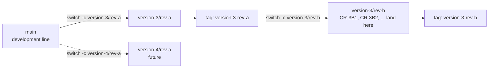

# 010 — Versioning

This document governs how the Dexter specification evolves: the numbered version line, the design identity
of a released spec set, the git branch model that carries versions and revisions, and the procedure for
deriving a successor revision from the current design. It is the meta-specification — it specifies how to
change the specification.

Two companions complete the picture: the forward roadmap of intended improvements is
[011-Roadmap.md](011-Roadmap.md), and the recorded history of what actually changed in each revision is
[CHANGES.md](../CHANGES.md) in the repository root.

## 1. Version lineage

Dexter is a line of robots, numbered in order. Each version is a distinct machine: parts, geometry,
drivetrains, and firmware constants differ, and versions are not interchangeable. Earlier versions also
carried product names; those names are historical and are not how a design is identified.

| Version | Historical name | Body material | Wrist J4/J5 resolution | Base | Calibration model |
|---|---|---|---|---|---|
| 1 | Dexter 1 | PLA (FDM) | Microstep oscillation | Free-standing | Field-calibrated |
| 2 | Dexter HD | Onyx / carbon-fiber | Microstep oscillation (firmware `Interpolation` 16×) | 6-leg strake base, single clamp | Field-calibrated |
| **3** | Dexter HDI | Onyx / carbon-fiber | **Belt/pulley reduction** (`Interpolation` 1×) | **Bolted base, double clamp** | **Factory-recorded, not re-calibrated in field** |

Version 3 develops the version 2 architecture rather than replacing it; this is why version 2 serves as the
inherited baseline for any subassembly whose design version 3 does not independently establish. The
concrete deltas are specified where they apply:
[003-Kinematics.md](003-Kinematics.md#link-lengths) (link geometry),
[004-Mechanical-Architecture.md](004-Mechanical-Architecture.md) (base, wrist, differential),
[005-Electronics-and-Control.md](005-Electronics-and-Control.md) (wiring), and
[006-Firmware-and-Calibration.md](006-Firmware-and-Calibration.md) (drive constants, calibration policy),
and are recorded as the opening section of [CHANGES.md](../CHANGES.md).

## 2. Design identity

A design identity has three parts:

- **Version** — a numbered machine and its architecture (version 3). The next version is developed on
  `main` and comes into being when it is branched ([§3](#3-branch-model)).
- **Revision** — a lettered issue of a version's design of record (revision A, B, …). A new revision is a
  change to the *specified design* of the same version: it may change parts, geometry, firmware, or
  procedure, but stays within that version's architecture. A released revision is frozen by a git tag, which
  is the canonical way to retrieve it.
- **Build/serial** — an individual physical robot built to a revision (e.g. a unit carrying its own factory
  calibration record, analogous to the serialized `HDI-007010` unit whose measured kinematics seed
  [003-Kinematics.md](003-Kinematics.md)). Serials are not spec versions; they are instances. A build record
  names the revision tag the unit was built to, which is what ties the physical robot to an exact
  specification.

A change large enough to break the current architecture (a different reduction principle on the base joints,
a different sensing method, a different control platform) is the **next version**, developed on `main`, not
a revision.

**The specification does not state its own version and revision.** Which design a document belongs to is
determined by the branch or tag it is read at ([§3](#3-branch-model)), so no document carries a version or revision in its
title or prose. Identity is written down in exactly two places: [CHANGES.md](../CHANGES.md), which records
each revision and the tag that freezes it, and this document, which defines the scheme. Keeping it out of
the documents themselves means a revision branch does not begin with a mechanical retitling pass, and no
file can disagree with the ref it is read at.

## 3. Branch model

`main` is the development line. It always holds the latest design of the robot, ahead of any released
version, and it is where the next version is developed. Releasing a version does not stop `main`; work
continues there toward the version after it.

Versions and revisions are carried by git branches and tags. There are no per-revision directories, no
`specs-rev-b/` trees, and no version or revision suffixes in file names. Every document keeps one path for
the life of the project. This keeps `git diff` and `git log` the authoritative diff between revisions, and
keeps cross-document links stable.

| Object | Name | Role |
|---|---|---|
| Development line | `main` | The latest design; where the next version is developed |
| Revision branch | `version-<n>/rev-<letter>` — e.g. `version-3/rev-a` | Where a revision of version *n* is developed and maintained |
| Release tag | `version-<n>-rev-<letter>` — e.g. `version-3-rev-a` | An immutable freeze of a released revision |

`version-<n>/` is a namespace, not a branch: git cannot hold a branch named `version-3` and a branch named
`version-3/rev-a` at the same time, because the first occupies the ref path the second needs. A version's
line is therefore its revision branches, the first of which is `version-3/rev-a`.



Rules:

- **A version is created by branching its first revision from `main`**: `git switch -c version-3/rev-a main`.
- **A later revision branches from the revision it deltas against**, so it starts from exactly the frozen
  design it changes: `git switch -c version-3/rev-b version-3-rev-a`.
- **A revision is released by tagging its branch**: `git tag -a version-3-rev-b`. The tag is the release
  event; there is no release merge.
- **A prior revision is retrieved by checking out its tag** (`git switch --detach version-3-rev-a`), not by
  reading an archived copy. Tags are never moved or rewritten once published.
- **A revision branch stays open after release**, and is where any later work on that released machine
  happens; `main` is never a work area for a released version. A change made on a revision branch that also
  belongs in the ongoing design is merged or cherry-picked to `main`.
- **A single change request may take its own short-lived branch** off the revision branch, named as a
  sibling of it (`version-3/rev-b-wrist`, not `version-3/rev-b/wrist`, which the ref path forbids for the
  same reason as above), merged back when complete. This is optional, and appropriate when a change is
  large enough to want isolated review.
- **Version numbers are assigned in order and never reused.** Revision letters restart at A for each
  version, which is why a tag names both (`version-4-rev-a` is not `version-3-rev-a`).

## 4. Revision procedure — how to derive the next revision

The specification is written so the next revision is a **delta against the current one**, not a rewrite. To
author revision B of version 3 (or any successor):

1. **Branch the spec set.** `git switch -c version-3/rev-b version-3-rev-a`. Revision A remains frozen at
   its tag; nothing is copied.
2. **Open the change set.** Add a new revision section at the top of [CHANGES.md](../CHANGES.md) and record
   each intended change as a delta in the format of [§5](#5-change-record-format): the design item it modifies (by document and
   section), the old design, the new design, and the rationale. The section is opened when the branch is
   created and filled in as changes land, so it reads as the human-readable diff between revisions.
3. **Amend requirements first.** Apply changes that alter *what the robot must do* to
   [002-Requirements.md](002-Requirements.md). Requirements are the root of the derivation; change them
   before touching mechanics.
4. **Re-derive downstream.** Propagate each requirement change through kinematics (003), mechanical
   architecture (004), and electronics/control (005), then regenerate the derived artifacts — firmware
   configuration (006), bill of materials (007), and assembly (008). The dependency order is:
   `002 → 003 → 004 → 005 → {006, 007, 008}`.
5. **Carry forward open decisions.** Any [009-Design-Completion.md](009-Design-Completion.md) `[TBD]` item
   still open at the time of branching is inherited by the new revision unless the change set closes it.
6. **Re-mark design status.** A `[Specified]` item whose design the revision changes reverts to
   `[Provisional]` until re-validated on a physical build of the new revision. Do not carry a prior
   revision's validation forward across a design change.
7. **Release.** `git tag -a version-3-rev-b`, then mark the revision's section in
   [CHANGES.md](../CHANGES.md) as released with its tag and date. Merge or cherry-pick to `main` any change
   that also belongs in the ongoing design.

**Starting a new version** follows the same shape, from `main` rather than from a tag: when the design on
`main` is ready to be built as a machine, `git switch -c version-4/rev-a main` and tag it `version-4-rev-a`
once released. Add the version to the table in [§1](#1-version-lineage), and open its first section in
[CHANGES.md](../CHANGES.md) recording the deltas against the previous version — the same role the version 3
section plays today.

## 5. Change-record format

All revision history lives in a single file, [CHANGES.md](../CHANGES.md) in the repository root, with one
section per revision, newest first, so the file reads as the project's design history. Each change within a
revision section uses this shape, so revisions remain auditable:

```
### CR-<version><revision-letter><n>: <short title>
- **Affects:** <doc §section> [, <doc §section> …]
- **Was:** <the previous revision's design>
- **Now:** <the new design>
- **Driver:** <requirement / defect / improvement that motivates the change>
- **Status:** [Specified | Provisional | TBD]
- **Re-derive:** <downstream artifacts to regenerate: 006/007/008 as applicable>
```

Change-request IDs carry the version and revision they belong to (`CR-3B1`, `CR-3B2`, … in version 3
revision B) so they stay unique across the whole history and identify their origin on sight. Because
revision letters restart with each version, the version number is part of the ID.
