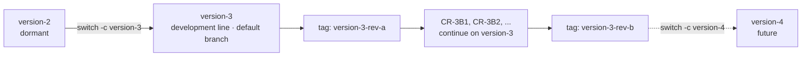

# 010 — Versioning

This document governs how the Dexter specification evolves: the numbered version line, the design identity
of a released spec set, the git branch model that carries versions and revisions, and the procedure for
deriving a successor revision from the current design. It is the meta-specification — it specifies how to
change the specification.

Two companions complete the picture: the forward roadmap of intended improvements is
[011-Roadmap.md](011-Roadmap.md), and the recorded history of what actually changed in each revision is
[CHANGES.md](../CHANGES.md) in the repository root.

## 1. Version lineage

Dexter is a line of robots, numbered in order. Each version is a distinct machine: parts, geometry,
drivetrains, and firmware constants differ, and versions are not interchangeable. Earlier versions also
carried product names; those names are historical and are not how a design is identified.

| Version | Historical name | Body material | Wrist J4/J5 resolution | Base | Calibration model |
|---|---|---|---|---|---|
| 1 | Dexter 1 | PLA (FDM) | Microstep oscillation | Free-standing | Field-calibrated |
| 2 | Dexter HD | Onyx / carbon-fiber | Microstep oscillation (firmware `Interpolation` 16×) | 6-leg strake base, single clamp | Field-calibrated |
| **3** | Dexter HDI | Onyx / carbon-fiber | **Belt/pulley reduction** (`Interpolation` 1×) | **Bolted base, double clamp** | **Factory-recorded, not re-calibrated in field** |

Version 3 develops the version 2 architecture rather than replacing it; this is why version 2 serves as the
inherited baseline for any subassembly whose design version 3 does not independently establish. The
concrete deltas are specified where they apply:
[003-Kinematics.md](003-Kinematics.md#link-lengths) (link geometry),
[004-Mechanical-Architecture.md](004-Mechanical-Architecture.md) (base, wrist, differential),
[005-Electronics-and-Control.md](005-Electronics-and-Control.md) (wiring), and
[006-Firmware-and-Calibration.md](006-Firmware-and-Calibration.md) (drive constants, calibration policy),
and are recorded as the opening section of [CHANGES.md](../CHANGES.md).

## 2. Design identity

A design identity has three parts:

- **Version** — a numbered machine and its architecture (version 3). A version comes into being when its
  line is branched from the version it develops from ([§3](#3-branch-model)), and that line carries every
  revision of the machine.
- **Revision** — a lettered issue of a version's design of record (revision A, B, …). A new revision is a
  change to the *specified design* of the same version: it may change parts, geometry, firmware, or
  procedure, but stays within that version's architecture. A revision is carried by its version's line, not
  by a line of its own ([§3](#3-branch-model)); a released revision is frozen by a git tag, which is the
  canonical way to retrieve it.
- **Build/serial** — an individual physical robot built to a revision (e.g. a unit carrying its own factory
  calibration record, analogous to the serialized `HDI-007010` unit whose measured kinematics seed
  [003-Kinematics.md](003-Kinematics.md)). Serials are not spec versions; they are instances. A build record
  names the revision tag the unit was built to, which is what ties the physical robot to an exact
  specification.

A change large enough to break the current architecture (a different reduction principle on the base joints,
a different sensing method, a different control platform) is the **next version** — a new line branched from
the current one — not a revision.

**The specification does not state its own version and revision.** Which design a document belongs to is
determined by the branch or tag it is read at ([§3](#3-branch-model)), so no document carries a version or revision in its
title or prose. Identity is written down in exactly two places: [CHANGES.md](../CHANGES.md), which records
each revision and the tag that freezes it, and this document, which defines the scheme. Keeping it out of
the documents themselves means a new revision does not begin with a mechanical retitling pass, and no
file can disagree with the ref it is read at.

## 3. Branch model

The repository holds one long-lived branch per version and one tag per released revision. There is no
`main`: every commit belongs to the line of a numbered machine, and the branch a commit sits on is what
says which machine it describes.

`version-<n>` is the line of version *n*. It is created when the version is opened, carries every revision
of that machine, and stays open for the life of the design. The newest version line is the development
line — it always holds the latest design, ahead of any released revision — and is the repository's
**default branch**; repointing the default is part of opening a new version.

Revisions are not branches. A revision is a stretch of its version's line, frozen at the end by a tag; work
continues past the tag on the same branch toward the next revision. There are no per-revision directories,
no `specs-rev-b/` trees, and no version or revision suffixes in file names. Every document keeps one path
for the life of the project. This keeps `git diff` and `git log` the authoritative diff between revisions,
and keeps cross-document links stable.

| Object | Name | Role |
|---|---|---|
| Version line | `version-<n>` — e.g. `version-3` | Where version *n* is developed and maintained, across all its revisions |
| Release tag | `version-<n>-rev-<letter>` — e.g. `version-3-rev-a` | An immutable freeze of a released revision |

Because `version-3` occupies that ref path, git cannot also hold a branch beneath it: `version-3/wrist` and
`version-3` cannot coexist. A short-lived topic branch is therefore named as a sibling rather than a child —
`v3-wrist-reduction`, not `version-3/wrist`.



Rules:

- **A version is opened by branching a new line from the one it develops from**: `git switch -c version-4
  version-3`. The new line becomes the repository's default branch; the previous line stays open but
  dormant.
- **A revision is released by tagging its version line**: `git tag -a version-3-rev-b version-3`. The tag is
  the release event; there is no release branch and no release merge.
- **A prior revision is retrieved by checking out its tag** (`git switch --detach version-3-rev-a`), not by
  reading an archived copy. Tags are never moved or rewritten once published.
- **A released revision is never reopened.** An error found in a released revision is corrected as a change
  in the next revision of the same version, so the tag continues to describe exactly the machines built to
  it.
- **A version line stays open after its successor opens**, and is where any later work on that machine
  happens. A change made on an older line that also belongs in the current design is merged or cherry-picked
  forward.
- **A single change request may take its own short-lived branch** off the version line, named as described
  above, merged back when complete. This is optional, and appropriate when a change is large enough to want
  isolated review.
- **Version numbers are assigned in order and never reused.** Revision letters restart at A for each
  version, which is why a tag names both (`version-4-rev-a` is not `version-3-rev-a`).

## 4. Revision procedure — how to derive the next revision

The specification is written so the next revision is a **delta against the current one**, not a rewrite. To
author revision B of version 3 (or any successor):

1. **Open the revision.** Work continues on `version-3`; there is no branch to create. Revision A remains
   frozen at its tag, and revision B begins at the first commit past it.
2. **Open the change set.** Add a new revision section at the top of [CHANGES.md](../CHANGES.md) and record
   each intended change as a delta in the format of [§5](#5-change-record-format): the design item it modifies (by document and
   section), the old design, the new design, and the rationale. The section is opened when the branch is
   opened at the first commit of the revision and filled in as changes land, so it reads as the
   human-readable diff between revisions.
3. **Amend requirements first.** Apply changes that alter *what the robot must do* to
   [002-Requirements.md](002-Requirements.md). Requirements are the root of the derivation; change them
   before touching mechanics.
4. **Re-derive downstream.** Propagate each requirement change through kinematics (003), mechanical
   architecture (004), and electronics/control (005), then regenerate the derived artifacts — firmware
   configuration (006), bill of materials (007), and assembly (008). The dependency order is:
   `002 → 003 → 004 → 005 → {006, 007, 008}`.
5. **Carry forward open decisions.** Any [009-Design-Completion.md](009-Design-Completion.md) `[TBD]` item
   still open when the revision opens is inherited by it unless the change set closes it.
6. **Re-mark design status.** A `[Specified]` item whose design the revision changes reverts to
   `[Provisional]` until re-validated on a physical build of the new revision. Do not carry a prior
   revision's validation forward across a design change.
7. **Release.** `git tag -a version-3-rev-b version-3`, then mark the revision's section in
   [CHANGES.md](../CHANGES.md) as released with its tag and date.

**Starting a new version** follows the same shape on a new line: when a change departs from the current
version's architecture ([§2](#2-design-identity)), `git switch -c version-4 version-3`, repoint the
repository default branch to it, and tag `version-4-rev-a` when its first revision is released. Add the
version to the table in [§1](#1-version-lineage), and open its first section in
[CHANGES.md](../CHANGES.md) recording the deltas against the previous version — the same role the version 3
section plays today.

## 5. Change-record format

All revision history lives in a single file, [CHANGES.md](../CHANGES.md) in the repository root, with one
section per revision, newest first, so the file reads as the project's design history. Each change within a
revision section uses this shape, so revisions remain auditable:

```
### CR-<version><revision-letter><n>: <short title>
- **Affects:** <doc §section> [, <doc §section> …]
- **Was:** <the previous revision's design>
- **Now:** <the new design>
- **Driver:** <requirement / defect / improvement that motivates the change>
- **Status:** [Specified | Provisional | TBD]
- **Re-derive:** <downstream artifacts to regenerate: 006/007/008 as applicable>
```

Change-request IDs carry the version and revision they belong to (`CR-3B1`, `CR-3B2`, … in version 3
revision B) so they stay unique across the whole history and identify their origin on sight. Because
revision letters restart with each version, the version number is part of the ID.
